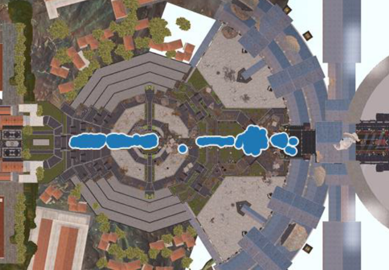

# Tracking Data

In order to make data-driven decisions at a startup, you need to collect data about how your products are being used. You also need to be able to measure the impact of making changes to your product and the efficacy of running campaigns, such as deploying a custom audience for marketing on Facebook. Again, collecting data is necessary for accomplishing these goals.

Usually data is generated directly by the product. For example, a mobile game can generate data points about launching the game, starting additional sessions, and leveling up. But data can also come from other sources, such as an email vendor that provides response data about which users read and click on links within an email. This post focuses on the first type of data, where tracking events are being generated by the product.

Why record data about product usage?

- **Track metrics:** You may want to record performance metrics for tracking product health or other metrics useful for running the business.
- **Enable experimentation:** To determine if making changes to a product is beneficial, you need to be able to measure results.
- **Build data products:** In order to make something like a recommendation system, you need to know which items users are interacting with.

It’s been said that data is the new oil, and there’s a wide variety of reasons to collect data from products. When I first started in the gaming industry, data tracked from products was referred to as telemetry. Now, data collected from products is frequently called tracking.
This posts discusses what type of data to collect about product usage, how to send data to a server for analysis, issues when building a tracking API, and some concerns to consider when tracking user behavior.

## What to Record?
One of the first questions to answer when deploying a new product is:
What data should we collect about user behavior?

The answer is that it depends on your product and intended use cases, but there are some general guidelines about what types of data to collect across most web, mobile, and native applications.

- **Installs:** How big is the user base?
- **Sessions:** How engaged is the user base?
- **Monetization:** How much are users spending?

For these three types of events, the data may actually be generated from three different systems. Installation data might come from a third party, such as Google Play or the App Store, a session start event will be generated from the client application, and spending money in an application, or viewing ads, may be tracked by a different server. As long as you own the service that is generating the data points, you can use the same infrastructure to collect data about different types of events.

Collecting data about how many users launch and log into a application will enable you to answer basic questions about the size of your base, and enable you to track business metrics such as DAU, MAU, ARPDAU, and D-7 retention. However, it doesn’t provide much insight into what users are doing within an application, and it doesn’t provide many data points that are useful for building data products. In order to better understand user engagement, it’s necessary to track data points that are domain or product specific. For example, you might want to track the following types of events in a multiplayer shooter game for consoles:

- **GameStarted:** tracks when the player starts a single or multiplayer game.
- **PlayerSpawn:** tracks when the player spawns into the game world and tracks the class that the user is playing, such as combat medic.
- **PlayerDeath:** tracks where players are dying and getting stuck and enables calculating metrics such as KDR (kill/death ratio).
- **RankUp:** tracks when the player levels up or unlocks a new rank.

Most of these events translate well to other shooter games and other genres such as action/adventure. For a specific game, such as FIFA, you may want to record game specific events, such as:

- **GoalScored:** tracks when a point is scored by the player or opponent.
- **PlayerSubstitution:** tracks when a player is substituted.
- **RedCardReceived:** tracks when the player receives a red card.

Like the prior events, many of these game-specific events can actually be generalized to sports games. If you’re a company like EA with a portfolio of different sports titles, it’s useful to track all of these events across all of your sports titles (the red card event can be generalized to a penalty event).

If we’re able to collect these types of events about players, we can start to answer useful questions about the player base, such as:

- Are users that receive more red cards more likely to quit?
- Do online focused players play more than single-player focused players?
- Do users play the new career mode that was released?

A majority of tracking events are focused on collecting data points about released titles, but it’s also possible to collect data during development. At Microsoft Studios, I worked with the user research team to get tracking in place for playtesting. As a result, we could generate visualizations that were useful for conveying to game teams where players were getting stuck. Incorporating these visualizations into the playtesting results resulted in a much better reception from game teams.

```{r ryse, echo=FALSE, out.width="100%", fig.cap="Ryse: Son of Rome Playtesting — Microsoft Studios User Research"}

```

When you first add tracking to a product, you won’t know of every event and attribute that will be useful to record, but you can make a good guess by asking team members what types of questions they intend to ask about user behavior and by implementing events that are able to answer these questions. Even with good tracking data, you won’t be able to answer every question, but if you have good coverage you can start to improve your products.

## Tracking Specs
Some teams write tracking specifications to in order to define which tracking events need to be implemented in a product. Other teams don’t have any documentation and simply take a best guess approach at determining what to record. I highly recommend writing tracking specifications as a best practice. For each event, the spec should identify the conditions for firing an event, the attributes to send, and definitions for any event-specific attributes. For example, a session start event for a web app might have the following form:

- **Condition:** fired when the user first browses to the domain. The event should not be fired when the user clicks on new pages or uses the back button, but should fire it the user browses to a new domain and then back.
- **Properties:** web browser and version, userID, landing page, referring URL, client timestamp
- **Definitions:** referring URL should list the URL of the page that referred the user to this domain, or the application that referred the user to the web page (e.g. Facebook or Twitter).

Tracking specs are a highly useful piece of documentation. Small teams might be able to get away without having an official process for writing tracking specs, but a number of scenarios can make the documentation critical, such as implementing events on a new platform, re-implementing events for a new backend service, or having engineers leave the team. In order for specs to be useful, it’s necessary to answer the following questions:

- Who is responsible for writing the spec?
- Who is responsible for implementing the spec?
- Who is responsible for testing the implementation?

In small organizations, a data scientist might be responsible for all of the aspects of tracking. For a larger organization, it’s common for the owners to be a product manager, engineering team, and testing group.

## Client vs Server Tracking
Another consideration when setting up tracking for a product is determining whether to send events from a client application or a backend service. For example, a video-streaming web site can send data about which video a user is watching directly from the web browser, or from the backend service that is serving the video. While there are pros and cons to both approaches, I prefer setting up tracking for backend services rather than client applications if possible. Some of the benefits of server-side tracking are:

- **Trusted Source:** You don’t need to expose an endpoint on the web, and you know that events are being generated from your services rather than bots. This helps avoid fraud and DDoS attacks.
- **Avoid Ad Blocking:** If you send data from a client application to an endpoint exposed on the web, some users may block access to the endpoint, which impacts business metrics.
- **Versioning:** You might need to make changes to an event. You can update your web servers as needed, but often cannot require users to update a client application.

Generating tracking from servers rather than client applications helps avoid issues around fraud, security, and versioning. However, there are some drawbacks to server-side tracking:

- **Testing:** You might need to add new events or modify existing tracking events for testing purposes. This is often easier to do by making changes on the client side.
- **Data availability:** Some of the events that you might want to track do not make calls to a web server. For example, a console game might not connect to any web services during a session start, and instead want until a multiplayer match starts. Also, attributes such as the referring URL may only be available for the client application and not the backend service.

A general guideline is to not trust anything sent by a client application, because often endpoints are not secured and there is no way to verify that the data was generated by your application. But client data is very useful, so it’s best to combine both client and server side tracking and to secure endpoints used for collecting tracking from clients.

## Sending Tracking Events
The goal of sending data to a server is to make the data available for analysis and data products. There’s a number of different approaches that can be used based on your use case. This section introduces three different ways of sending events to an endpoint on the web and saving the events to local storage. The samples below are not intended to be production code, but instead simple proofs of concept. The next chapter covers building a pipeline for processing events. All code for the samples below is available on Github.

### Web Call
The easiest way to set up a tracking service is by making web calls with the event data to a web site. This can be implemented with a lightweight PHP script, which is shown in the code block below.

```{r eval=FALSE}
<?php
    $message = $_GET['message'];
    if ($message != '') {
        $dataFile = fopen("telemetry.log", "a");
        fwrite($dataFile, "$message\n");
        fflush($dataFile);
        fclose($dataFile);
    }
?>
```

This php script reads the message parameter from the URL and appends the message to a local file. The script can be invoked by making a web call:

```{r eval=FALSE}
http://.../tracking.php?message=Hello_World
```

The call can be made from a Java client or server using the following code:

```{r eval=FALSE}
// endpoint
String endPoint = "http://.../tracking.php";

// send the message
String message = "Hello_World";   
URL url = new URL(endPoint + "?message=" + message);  
URLConnection con = url.openConnection();  
BufferedReader in = new BufferedReader(new 
    InputStreamReader(con.getInputStream()));  

// process the response 
while (in.readLine() != null) {}  
in.close();
```

This is one of the easiest ways to start collecting tracking data, but it doesn’t scale and it’s not secure. It’s useful for testing, but should be avoided for anything customer facing. I did use this approach in the past to collect data about players for a Mario level generator experiment.

### Web Server.
Another approach you can use is setting up a web service to collect tracking events. The code below shows how to use Jetty to set up a lightweight service for collecting data. In order to compile and run the example, you’ll need to include the following pom file. The first step is to start a web service that will handle tracking requests:

```{r eval=FALSE}
public class TrackingServer extends AbstractHandler {
  public static void main(String[] args) {
    Server server = new Server(8080);
    server.setHandler(new TrackingServer());
    server.start();
    server.join();
  }
  
  public void handle(String target, 
    Request baseRequest, HttpServletRequest request, 
    HttpServletResponse response) 
    throws IOException, ServletException {
        
    // Process Request
  }
}
```

In order to process events, the application reads the message parameter from the web request, appends the message to a local file, and then responds to the web request. The full code for this example is available here.

```{r eval=FALSE}
// append the event data to a local file 
String message = baseRequest.getParameter("message");
if (message != null) {
  BufferedWriter writer = new BufferedWriter(
      new FileWriter("tracking.log", true));
  writer.write(message + "\n");
  writer.close();
}

// service the web request
response.setStatus(HttpServletResponse.SC_OK);
```

In order to call the endpoint with Java, we’ll need to modify the URL:

```{r eval=FALSE}
URL url = new URL(
    "http://localhost:8080/?message=" + message);
```

This approach can scale a bit more than the PHP approach, but is still insecure and not the best approach for building a production system. My advice for building a production ready tracking service is to use a stream processing system such as Kafka, Amazon Kinesis, or Google’s PubSub.

### Subscription Service
Using messaging services such as PubSub enables systems to collect massive amounts of tracking data, and forward the data to a number of different consumers. Some systems such as Kafka require setting up and maintaining servers, while other approaches like PubSub are managed services that are serverless. Managed services are great for startups, because they reduce the amount of DevOps support needed. But the tradeoff is cost, and it’s pricer to use managed services for massive data collection.

The code below shows how to use Java to post a message to a topic on PubSub. The full code listing is available here and the pom file for building the project is available here. In order to run this example, you’ll need to set up a free google cloud project, and enable PubSub. More details on setting up GCP and PubSub are available in this post.

```{r eval=FALSE}
// Set up a publisher
TopicName topicName = 
    TopicName.of("projectID", "raw-events");
Publisher publisher = Publisher
    .newBuilder(topicName).build();

//schedule a message to be published
String message = "Hello World!";
PubsubMessage msg = PubsubMessage
    .newBuilder().setData(ByteString
    .copyFromUtf8(message)).build();
    
// publish the message, add a callback listener
ApiFuture<String> future = publisher.publish(msg);
ApiFutures.addCallback(future, 
    new ApiFutureCallback<String>() {
      
  public void onFailure(Throwable arg0) {}
  public void onSuccess(String arg0) {}
});

publisher.shutdown();
```

This code example shows how to send a single message to PubSub for recording a tracking event. For a production system, you’ll want to implement the onFailure method in order to deal with failed deliveries. The code above shows how to send a message with Java, while other languages are supported including Go, Python, C#, and PHP. It’s also possible to interface with other stream processing systems such as Kafka.

The next code segment shows how to read a message from PubSub and append the message to a local file. The full code listing is available here. In the next post I’ll show how to consume messages using DataFlow.

```{r eval=FALSE}
// set up a message handler
MessageReceiver receiver = new MessageReceiver() {
  public void receiveMessage(PubsubMessage message, 
    AckReplyConsumer consumer) {
    try {
      BufferedWriter writer = new BufferedWriter(new
        FileWriter("tracking.log", true));
      writer.write(
          message.getData().toStringUtf8() + "\n");
      writer.close();
      consumer.ack();
    }
    catch (Exception e) {}
}};

// start the listener for 1 minute
SubscriptionName subscriptionName =
    SubscriptionName.of("projectId", "raw-events");
Subscriber subscriber = Subscriber.newBuilder(
    subscriptionName, receiver).build();

subscriber.startAsync();
Thread.sleep(60000);
subscriber.stopAsync();
```

We now have a way of getting data from client applications and backend services to a central location for analysis. The last approach shown is a scalable and secure method for collecting tracking data, and is a managed service making it a good fit for startups with small data teams.

## Message Encoding
One of the decisions to make when sending data to an endpoint for collection is how to encode the messages being sent, since all events that are sent from an application to an endpoint need to be serialized. When sending data over the internet, it’s good to avoid language specific encodings, such as Java serialization, because the application and backend services are likely implemented in different languages. There’s also versioning issues that can arise when using a language-specific serialization approach.

Some common ways of encoding tracking events are using the JSON format and Google’s protocol buffers. JSON has the benefit of being human readable and supported by a wide variety of languages, while buffers provide better comprension and may better suited for certain data structures. One of the benefits of using these approaches is that a schema does not need to be defined before you can send events, since metadata about the event is included in the message. You can add new attributes as needed, and even change data types, but this may impact downstream event processing.

When getting started with building a data pipeline, I’d recommended using JSON to get started, since it’s human readable and supported by a wide variety of languages. It’s also good to avoid encodings such as pipe-delimited formats, because you many need to support more complex data structures, such as lists or maps, when you update your tracking events. Here’s an example of what a message might look like:

```{r eval=FALSE}
# JSON
{"Type":"Session","Version":1.0,"UserID":"12345"
    ,"Platform":"iOS"}

# Pipe delimited
Session|1.0|12345|iOS
``` 

What about XML? No!

## Building a Tracking API
To build a production system, you’ll need to add a bit more sophistication to your tracking code. A production system should handle the following issues:

- **Delivery Failures:** if a message delivery fails, the system should retry sending the message, and have a backoff mechanism.
- **Queueing:** if the endpoint is not available, such as a phone without a signal, the trackling library should be able to store events for later transmission, such as when wifi is available.
- **Batching:** instead of sending a large number of small requests, it’s often useful to send batches of tracking events.
- **Prioritization:** some messages are more important to track than others, such as preferring monetization events over click events. A tracking library should be able to prioritize more critical events.

It’s also useful to have a process in place for disabling tracking events. I’ve seen data pipelines explode from client applications sending way too much data, and there was no way of disabling the clients from sending the problematic event without turning off all tracking.

Ideally, a production level system should have some sort of auditing in place, in order to validate that the endpoints are receiving all of the data being sent. One approach is to send data to a different endpoint built on a different infrastructure and tracking library, but that much redundancy is usually overkill. A more lightweight approach is to add a sequential counting attribute to all events, so if a client sends 100 messages, the backend can use this attribute to know how many events the client attempted to send and validate the result.

## Privacy
There’s privacy concerns to consider when storing user data. When data is being made available to analytics and data science teams, all personally identifiable information (PII) should be stripped from events, which can include names, addresses, and phone numbers. In some instances, user names, such as a player’s gamertag on Steam, may be considered PII as well. It’s also good to strip IP addresses from any data being collected, to limit privacy concerns. The general recommendation is to collect as much behavioral data as needed to answer questions about product usage, while avoiding the need to collect sensitive information, such as gender and age. If you’re building a product based on sensitive information, you should have strong user access controls in place to limit access to sensitive data. Policies such GDPR are setting new regulations for collecting and processing data, and GDPR should be reviewed before shipping a product with tracking.

## Conclusion 
Tracking data enables teams to answer a variety of questions about product usage, enables teams to track the performance and health of products, and can be used to build data products. This post discussed some of the issues involved in collecting data about user behavior, and provided examples for how to send data from a client application to an endpoint for later analysis. Here are the key takeaways to from this chapter:

- Use server-side tracking if possible. It helps avoid a wide variety of issues.
- QA/test your tracking events. If you’re sending bad data, you may be drawing incorrect conclusions from your data.
- Have a versioning system in place. You’ll need to add new events and modify existing events, and this should be a simple process.
- Use JSON for sending events. It’s human readable, extensible, and supported by a wide variety of languages
- Use managed services for collecting data. You won’t need to spin up servers and can collect huge amounts of data.

As you ship more products and scale up your user base, you may need to change to a different data collection platform, but this advice is a good starting point for shipping products with tracking.
