# Data Pipelines 
Building data pipelines is a core component of data science at a startup. In order to build data products, you need to be able to collect data points from millions of users and process the results in near real-time. While the previous chapter discussed what type of data to collect and how to send data to an endpoint, this chapter will discuss how to process data that has been collected, enabling data scientists to work with the data. The chapter on model production will discuss how to deploy models on this data platform.

Typically, the destination for a data pipeline is a data lake, such as Hadoop or parquet files on S3, or a relational database, such as Redshift. A data pipeline should have the following properties:

- **Low Event Latency:** Data scientists should be able to query recent event data in the pipeline, within minutes or seconds of the event being sent to the data collection endpoint. This is useful for testing purposes and for building data products that need to update in near real-time.
- **Scalability:** A data pipeline should be able to scale to billions of data points, and potentially trillions as a product scales. A high performing system should not only be able to store this data, but make the complete data set available for querying.
- **Interactive Querying:** A high functioning data pipeline should support both long-running batch queries and smaller interactive queries that enable data scientists to explore tables and understand the schema without having to wait minutes or hours when sampling data.
- **Versioning:** You should be able to make changes to your data pipeline and event definitions without bringing down the pipeline and suffering data loss. This chapter will discuss how to build a pipeline that supports different event definitions, in the case of changing an event schema.
- **Monitoring:** If an event is no longer being received, or tracking data is no longer being received for a particular region, then the data pipeline should generate alerts through tools such as PagerDuty.
- **Testing:** You should be able to test your data pipeline with test events that do not end up in your data lake or database, but that do test components in the pipeline.

There's a number of other useful properties that a data pipeline should have, but this is a good starting point for a startup. As you start to build additional components that depend on your data pipeline, you'll want to set up tooling for fault tolerance and automating tasks.

This chapter will show how to set up a scalable data pipeline that sends tracking data to a data lake, database, and subscription service for use in data products. I'll discuss the different types of data in a pipeline, the evolution of data pipelines, and walk through an example pipeline implemented on GCP. 

Before deploying a data pipeline, you'll want to answer the following questions, which resemble our questions about tracking specs:

- Who owns the data pipeline?
- Which teams will be consuming data?
- Who will QA the pipeline?

In a small organization, a data scientist may be responsible for the pipeline, while larger organizations usually have an infrastructure team that is responsible for keeping the pipeline operational. It's also useful to know which teams will be consuming the data, so that you can stream data to the appropriate teams. For example, marketing may need real-time data of landing page visits to perform attribution for marketing campaigns. And finally, the data quality of events passed to the pipeline should be thoroughly inspected on a regular basis. Sometimes a product update will cause a tracking event to drop relevant data, and a process should be set up to capture these types of changes in data.

## Types of Data
Data in a pipeline is often referred to by different names based on the amount of modification that has been performed. Data is typically classified with the following labels: 

- **Raw:** Is tracking data with no processing applied. This is data stored in the message encoding format used to send tracking events, such as JSON. Raw data does not yet have a schema applied. It's common to send all tracking events as raw events, because all events can be sent to a single endpoint and schemas can be applied later on in the pipeline.
- **Processed:** Processed data is raw data that has been decoded into event specific formats, with a schema applied. For example, JSON tracking events that have been translated into session start events with a fixed schema are considered processed data. Processed events are usually stored in different event tables/destinations in a data pipeline.
- **Cooked:** Processed data that has been aggregated or summarized is referred to as cooked data. For example, processed data could include session start and session end events, and be used as input to cooked data that summarizes daily activity for a user, such as number of sessions and total time on site for a web page.

Data scientists will typically work with processed data, and use tools to create cooked data for other teams. This chapter discusses how to build a data pipeline that outputs processed data, while the Business Intelligence chapter will discuss how to add cooked data to your pipeline.

## The Evolution of Data Pipelines
Over the past two decades the landscape for collecting and analyzing data has changed significantly. Rather than storing data locally via log files, modern systems can track activity and apply machine learning in near real-time. Startups might want to use one of the earlier approaches for initial testing, but should really look to more recent approaches for building data pipelines. Based on my experience, I've noticed four different approaches to pipelines:

- **Flat File Era:** Data is saved locally on game servers.
- **Database Era:** Data is staged in flat files and then loaded into a database.
- **Data Lake Era:** Data is stored in Hadoop/S3 and then loaded into a DB.
- **Serverless Era:** Managed services are used for storage and querying.

Each of the steps in this evolution support the collection of larger data sets, but may introduce additional operational complexity. For a startup, the goal is to be able to scale data collection without scaling operational resources, and the progression to managed services provides a nice solution for growth.

The data pipeline that we'll walk through in the next section of this chapter is based on the most recent era of data pipelines, but it's useful to walk through different approaches because the requirements for different companies may fit better with different architectures.

### Flat File Era
I got started in data science at Electronic Arts in 2010, before EA had an organization built around data. While many game companies were already collecting massive amounts of data about gameplay, most telemetry was stored in the form of log files or other flat file formats that were stored locally on the game servers. Nothing could be queried directly, and calculating basic metrics such as monthly active users (MAU) took substantial effort.

```{r 3-1, echo=FALSE, out.width="70%", fig.align="center", fig.cap="Components in a pre-database Analytics Architecture."}
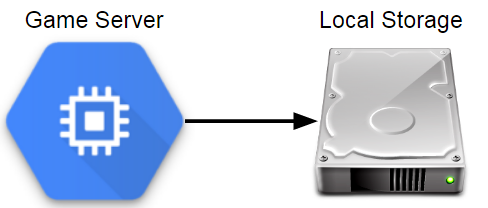
```

At Electronic Arts, a replay feature was built into Madden NFL 11 which provided an unexpected source of game telemetry. After every game, a game summary in an XML format was sent to a game server that listed each play called, moves taken during the play, and the result of the down. This resulted in millions of files that could be analyzed to learn more about how players interacted with Madden football in the wild.

Storing data locally is by far the easiest approach to take when collecting gameplay data. For example, the PHP approach presented in the last chapter is useful for setting up a lightweight analytics endpoint. But this approach does have significant drawbacks.

This approach is simple and enables teams to save data in whatever format is needed, but has no fault tolerance, does not store data in a central location, has significant latency in data availability, and has no standard tooling for building an ecosystem for analysis. Flat files can work fine if you only have a few servers, but it's not really an analytics pipeline unless you move the files to a central location. You can write scripts to pull data from log servers to a central location, but it's not generally a scalable approach.

### Database Era
While I was at Sony Online Entertainment, we had game servers save event files to a central file server every couple of minutes. The file server then ran an ETL process about once an hour that fast loaded these event files into our analytics database, which was Vertica at the time. This process had a reasonable latency, about one hour from a game client sending an event to the data being queryable in our analytics database. It also scaled to a large volume of data, but required using a fixed schema for event data.

```{r 3-2, echo=FALSE, out.width="70%", fig.align="center", fig.cap="Components in an ETL-based Analytics Architecture."}
knitr::include_graphics("images/3-2.png")
```

When I was at Twitch, we used a similar process for one of our analytics databases. The main difference from the approach at SOE was that instead of having game servers scp files to a central location, we used Amazon Kinesis to stream events from servers to a staging area on S3. We then used an ETL process to fast load data into Redshift for analysis. Since then, Twitch has shifted to a data lake approach, in order to scale to a larger volume of data and to provide more options for querying the datasets.

The databases used at SOE and Twitch were immensely valuable for both of the companies, but we did run into challenges as we scaled the amount of data stored. As we collected more detailed information about gameplay, we could no longer keep complete event history in our tables and needed to truncate data older than a few months. This is fine if you can set up summary tables that maintain the most important details about these events, but it's not an ideal situation.

One of the issues with this approach is that the staging server becomes a central point of failure. It's also possible for bottlenecks to arise where one game sends way too many events, causing events to be dropped across all of the titles. Another issue is query performance as you scale up the number of analysts working with the database. A team of a few analysts working with a few months of gameplay data may work fine, but after collecting years of data and growing the number of analysts, query performance can be a significant problem, causing some queries to take hours to complete.

The main benefits of this approach are that all event data is available in a single location queryable with SQL and great tooling is available, such as Tableau and DataGrip, for working with relational databases. The drawbacks are that it's expensive to keep all data loaded into a database like Vertica or Redshift, events need to have a fixed schema, and truncating tables may be necessary.

Another issue with using a database as the main interface for data is that machine learning tools such as Spark's MLlib cannot be used effectively, since the relevant data needs to be unloaded from the database before it can be operated on. One of the ways of overcoming this limitation is to store gameplay data in a format and storage layer that works well with Big Data tools, such as saving events as Parquet files on S3. This type of configuration became more popular in the next era, and gets around the limitations of needing to truncate tables and reduces the cost of keeping all data.

### Data Lake Era
The data storage pattern that was most common while I was working as a data scientist in the games industry was a data lake. The general pattern is to store semi-structured data in a distributed database, and run ETL processes to extract the most relevant data to analytics databases. A number of different tools can be used for the distributed database: at Electronic Arts we used Hadoop, at Microsoft Studios we used Cosmos, and at Twitch we used S3.

```{r 3-3, echo=FALSE, out.width="100%", fig.cap="Components in a Data Lake Analytics Architecture."}
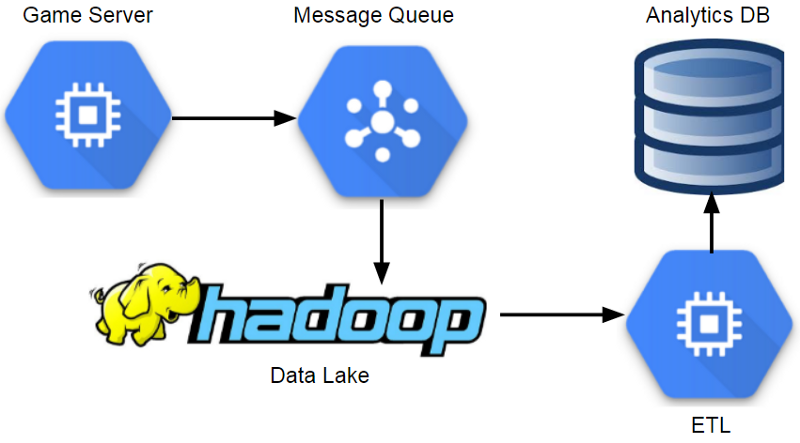
```

This approach enables teams to scale to massive volumes of data, and provides additional fault tolerance. The main downside is that it introduces additional complexity, and can result in analysts having access to less data than if a traditional database approach was used, due to lack of tooling or access policies. Most analysts will interact with data in the same way in this model, using an analytics database populated from data lake ETLs.

One of the benefits of this approach is that it supports a variety of different event schemas, and you can change the attributes of an event without impacting the analytics database. Another advantage is that analytics teams can use tools such as Spark SQL to work with the data lake directly. However, most places I worked at restricted access to the data lake, eliminating many of the benefits of this model.

This approach scales to a massive amount of data, supports flexible event schemas, and provides a good solution for long-running batch queries. The down sides are that it may involve significant operational overhead, may introduce large event latencies, and may lack mature tooling for the end users of the data lake. An additional drawback with this approach is that usually a whole team is needed just to keep the system operational. This makes sense for large organizations, but may be overkill for smaller companies. One of the ways of taking advantage of using a data lake without the cost of operational overhead is by using managed services.

### Serverless Era
In the current era, analytics platforms incorporate a number of managed services, which enable teams to work with data in near real-time, scale up systems as necessary, and reduce the overhead of maintaining servers. I never experienced this era while I was working in the game industry, but saw signs of this transition happening. Riot Games is using Spark^[https://databricks.com/customers/riot-games] for ETL processes and machine learning, and needed to spin up infrastructure on demand. Some game teams are using elastic computing methods for game services, and it makes sense to utilize this approach for analytics as well.

```{r 3-4, echo=FALSE, out.width="100%", fig.cap="Components in a managed Analytics Architecture."}
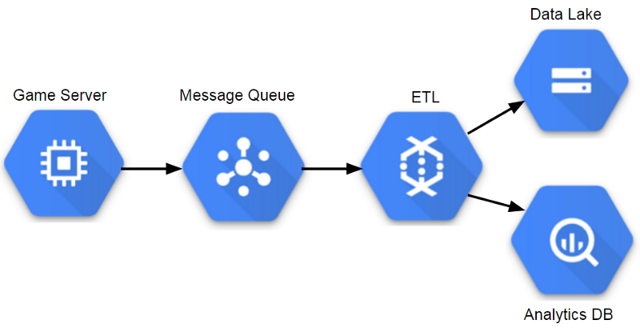
```

This approach has many of the same benefits as using a data lake, autoscales based on query and storage needs, and has minimal operational overhead. The main drawbacks are that managed services can be expensive, and taking this approach will likely result in using platform specific tools that are not portable to other cloud providers.

In my career I had the most success working with the database era approach, since it provided the analytics team with access to all of the relevant data. However, it wasn't a setup that would continue to scale and most teams that I worked on have since moved to data lake environments. In order for a data lake environment to be successful, analytics teams need access to the underlying data, and mature tooling to support their processes. For a startup, the serverless approach is usually the best way to start building a data pipeline, because it can scale to match demand and requires minimal staff to maintain the data pipeline. The next section will walk through building a sample pipeline with managed services.

## A Scalable Pipeline
We'll build a data pipeline that receives events using Google's PubSub as an endpoint, and save the events to a data lake and database. The approach presented here will save the events as raw data, but I'll also discuss ways of transforming the events into processed data.

The data pipeline that performs all of this functionality is relatively simple. The pipeline reads messages from PubSub and then transforms the events for persistence: the BigQuery portion of the pipeline converts messages to TableRow objects and streams directly to BigQuery, while the AVRO portion of the pipeline batches events into discrete windows and then saves the events to Google Storage. The graph of operations is shown in the figure above.

```{r 3-5, echo=FALSE, out.width="80%", fig.align="center", fig.cap="The streaming pipeline deployed to GCP."}
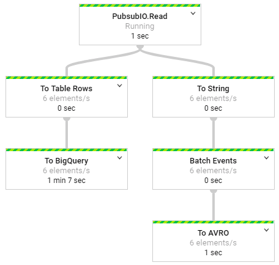
```


### Setting up the Environment
The first step in building a data pipeline is setting up the dependencies necessary to compile and deploy the project. I used the following maven dependencies to set up environments for the tracking API that sends events to the pipeline, and the data pipeline that processes events.

&nbsp;
```{r eval=FALSE}
<!-- Dependencies for the Tracking API ->
<dependency>
  <groupId>com.google.cloud</groupId>
  <artifactId>google-cloud-pubsub</artifactId>
  <version>0.32.0-beta</version>
  </dependency>
</dependencies>
<!-- Dependencies for the data pipeline ->
<dependency>
  <groupId>com.google.cloud.dataflow</groupId>
  <artifactId>google-cloud-dataflow-java-sdk-all
      </artifactId>
  <version>2.2.0</version>
</dependency>
```
  
I used Eclipse to author and compile the code for this tutorial, since it is open source. However, other IDEs such as IntelliJ provide additional features for deploying and monitoring DataFlow tasks. Before you can deploy jobs to Google Cloud, you'll need to set up a service account for both PubSub and DataFlow. Setting up these credentials is outside the scope of this book, and more details are available in the Google documentation^[https://cloud.google.com/bigquery/docs/authentication].

An additional prerequisite for running this data pipeline is setting up a PubSub topic on GCP. I defined a raw-events topic that is used for publishing and consuming messages for the data pipeline. Additional details on creating a PubSub topic are available online^[https://cloud.google.com/pubsub/docs/quickstart-console].

To deploy this data pipeline, you'll need to set up a java environment with the maven dependencies listed above, set up a Google Cloud project and enable billing, enable billing on the storage and BigQuery services, and create a PubSub topic for sending and receiving messages. All of these managed services do cost money, but there is a free tier that can be used for prototyping a data pipeline.

```{r 3-6, echo=FALSE, out.width="60%", fig.align="center", fig.cap="Sending events from a server to a PubSub topic."}

```

### Publishing Events
In order to build a usable data pipeline, it's useful to build APIs that encapsulate the details of sending event data. The Tracking API class provides this functionality, and can be used to send generated event data to the data pipeline. The code below shows the method signature for sending events, and shows how to generate sample data.

&nbsp;
```{r eval=FALSE}
// send a batch of events    
for (int i=0; i<10000; i++) {
  
  // generate event names      
  String type = Math.random() < 0.5 ? "Session"
   (Math.random() < 0.5 ? "Login" : "MatchStart");
  
  // create attributes to send      
  HashMap attributes = new HashMap();
  attributes.put("userID", (int)(Math.random()*100));
  attributes.put("deviceType", Math.random() < 0.5 ? 
    "Android" : (Math.random() < 0.5 ? "iOS" : "Web"));
  
  // send the event      
  tracking.sendEvent(type, "V1", attributes);      
}
```

The tracking API establishes a connection to a PubSub topic, passes events as a JSON format, and implements a callback for notification of delivery failures. The code used to send events is provided below, and is based on Google's PubSub example.

&nbsp;
```{r eval=FALSE}
// Setup a PubSub connection 
TopicName topicName = TopicName.of(projectID, topicID);
Publisher publisher = Publisher
    .newBuilder(topicName).build();

// Specify an event to send
String event = 
    {\"type\":\"session\",\"version\":\"1\"}";

// Convert the event to bytes    
ByteString data = ByteString
    .copyFromUtf8(event.toString());

//schedule a message to be published    
PubsubMessage msg = 
  PubsubMessage.newBuilder().setData(data).build();

// publish the message 
ApiFuture<String> future = publisher.publish(msg);    
ApiFutures.addCallback(future, this);
```

The code above enables apps to send events to a PubSub topic. The next step is to process this events in a fully-managed environment that can scale as necessary to meet demand.

### Storing Events
One of the key functions of a data pipeline is to make instrumented events available to data science and analytics teams for analysis. The data sources used as endpoints should have low latency and be able to scale up to a massive volume of events. The data pipeline defined in this tutorial shows how to output events to both BigQuery and a data lake that can be used to support a large number of analytics business users.

```{r 3-7, echo=FALSE, out.width="60%", fig.align="center", fig.cap="Streaming event data from PubSub to DataFlow."}
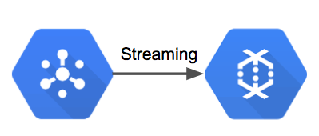
```

The first step in this data pipeline is reading events from a PubSub topic and passing ingested messages to the DataFlow process. DataFlow provides a PubSub connector that enables streaming of PubSub messages to other DataFlow components. The code below shows how to instantiate the data pipeline, specify streaming mode, and to consume messages from a specific PubSub topic. The output of this process is a collection of PubSub messages that can be stored for later analysis.

&nbsp;
```{r eval=FALSE}
// set up pipeline options    
Options options = PipelineOptionsFactory.fromArgs(args)
  .withValidation().as(Options.class);    
options.setStreaming(true);    
Pipeline pipeline = Pipeline.create(options);
  
// read game events from PubSub    
PCollection<PubsubMessage> events = pipeline
  .apply(PubsubIO.readMessages().fromTopic(topic));
```
  
The first way we want to store events is in a columnar format that can be used to build a data lake. While this chapter doesn't show how to utilize these files in downstream ETLs, having a data lake is a great way to maintain a copy of your data set in case you need to make changes to your database. The data lake provides a way to backload your data if necessary due to changes in schemas or data ingestion issues. The portion of the data pipeline allocated to this process is shown below.

```{r 3-8, echo=FALSE, out.width="50%", fig.align="center", fig.cap="Batching events to AVRO format and saving to GS."}
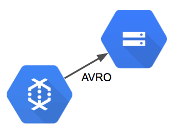
```

For AVRO, we can't use a direct streaming approach. We need to group events into batches before we can save to flat files. The way this can be accomplished in DataFlow is by applying a windowing function that groups events into fixed batches. The code below applies transformations that convert the PubSub messages into String objects, group the messages into 5 minute intervals, and output the resulting batches to AVRO files on Google Storage. To summarize, the code batches events into 5 minute windows and then exports the events to AVRO files on Google Storage.

&nbsp;
```{r eval=FALSE}
// AVRO output portion of the pipeline    
events.apply("To String", 
    ParDo.of(new DoFn<PubsubMessage, String>() {
      
  @ProcessElement        
  public void processElement(ProcessContext c)  {
    String msg = new String(c.element().getPayload());
    c.output(msg);        
  }      
}))

// Batch events into 5 minute windows      
.apply("Batch Events", Window.<String>into(    
    FixedWindows.of(Duration.standardMinutes(5)))       
  .triggering(AfterWatermark.pastEndOfWindow())     
  .discardingFiredPanes()              
  .withAllowedLateness(Duration.standardMinutes(5)))

// Save the events in ARVO format      
.apply("To AVRO", AvroIO.write(String.class)
  .to("gs://your_gs_bucket/avro/raw-events.avro")
  .withWindowedWrites() 
  .withSuffix(".avro"));
``` 

The result of this portion of the data pipeline is a collection of AVRO files on google storage that can be used to build a data lake. A new AVRO output is generated every 5 minutes, and downstream ETLs can parse the raw events into processed event-specific table schemas. The image below shows a sample output of AVRO files.

```{r 3-9, echo=FALSE, out.width="100%", fig.align="center", fig.cap="AVRO files saved to Google Storage."}
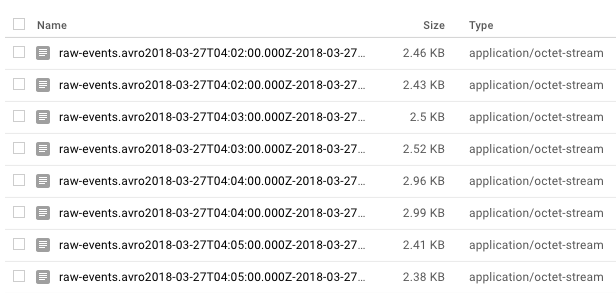
```

In addition to creating a data lake, we want the events to be immediately accessible in a query environment. DataFlow provides a BigQuery connector which serves this functionality, and data streamed to this endpoint is available for analysis after a short duration. This portion of the data pipeline is shown below.

```{r 3-10, echo=FALSE, out.width="50%", fig.align="center", fig.cap="Streaming events from DataFlow to BigQuery."}
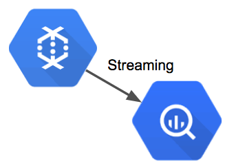
```

The data pipeline converts the PubSub messages into TableRow objects, which can be directly inserted into BigQuery. The code below consists of two apply methods: a data transformation and a IO writer. The transform step reads the message payloads from PubSub, parses the message as a JSON object, extracts the eventType and eventVersion attributes, and creates a TableRow object with these attributes in addition to a timestamp and the message payload. The second apply method tells the pipeline to write the records to BigQuery and to append the events to an existing table.

&nbsp;
```{r eval=FALSE}
// parse the PubSub events and create rows  
events.apply("To Table Rows", ParDo.of(new  
          DoFn<PubsubMessage, TableRow>() {    
     
 @ProcessElement          
 public void processElement(ProcessContext c) {
   String msg = new String(c.element().getPayload()); 
 
   // parse the json message for attributes
   JsonObject jsonObject = 
      new JsonParser().parse(msg).getAsJsonObject();
   String type = jsonObject.get("type").getAsString();
   String eventVersion = jsonObject.
       get("eventVersion").getAsString();          
   String serverTime = dateFormat.format(new Date()); 
 
   // create and output the table row            
   TableRow record = new TableRow();            
   record.set("eventType", type);               
   record.set("eventVersion", eventVersion);          
   record.set("serverTime", serverTime);
   record.set("message", message);            
   c.output(record);          
  }
}))
//stream the events to Big Query    
.apply("To BigQuery",BigQueryIO.writeTableRows()   
  .to(table)           
  .withSchema(schema)
  .withCreateDisposition(
    CreateDisposition.CREATE_IF_NEEDED)
  .withWriteDisposition(WriteDisposition.WRITE_APPEND))
```

Each message that is consumed from PubSub is converted into a TableRow object with a timestamp and then streamed to BigQuery for storage.
The result of this portion of the data pipeline is that events will be streamed to BigQuery and will be available for analysis in the output table specified by the DataFlow task. In order to effectively use these events for queries, you'll need to build additional ETLs for creating processed event tables with schematized records, but you now have a data collection mechanism in place for storing tracking events.

```{r 3-11, echo=FALSE, out.width="100%", fig.align="center", fig.cap="Game event records queried from the raw-events table in BigQuery."}
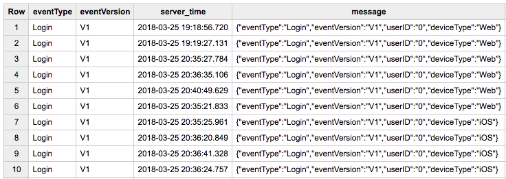
```

### Deploying and Auto Scaling
With DataFlow you can test the data pipeline locally or deploy to the cloud. If you run the code samples without specifying additional attributes, then the data pipeline will execute on your local machine. In order to deploy to the cloud and take advantage of the auto scaling capabilities of this data pipeline, you need to specify a new runner class as part of your runtime arguments. In order to run the data pipeline, I used the following runtime arguments:

&nbsp;
```{r eval=FALSE}
--runner=org.apache.beam.runners.dataflow.DataflowRunner 
--jobName=game-analytics
--project=your_project_id 
--tempLocation=gs://temp-bucket
```

Once the job is deployed, you should see a message that the job has been submitted. You can then click on the DataFlow console to see the task.
The runtime configuration specified above will not default to an auto scaling configuration. In order to deploy a job that scales up based on demand, you'll need to specify additional attributes:

```{r 3-12, echo=FALSE, out.width="80%", fig.align="center", fig.cap="The steaming data pipeline running on Google Cloud."}
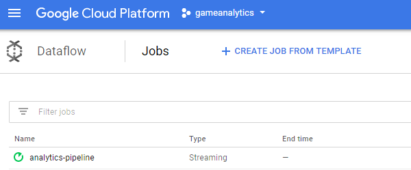
```

&nbsp;
```{r eval=FALSE}
--autoscalingAlgorithm=THROUGHPUT_BASED
--maxNumWorkers=30
``` 

Additional details on setting up a DataFlow task to scale to heavy workload conditions are available from Spotify^[https://labs.spotify.com/2016/03/10/]. The image above shows how DataFlow can scale up to meet demand as necessary.

```{r 3-13, echo=FALSE, out.width="100%", fig.align="center", fig.cap="An example of Dataflow auto scaling."}
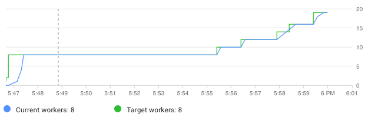
```

### Raw to Processed Events
The pipeline presented so far saves tracking events as raw data. To translate these events to processed data, we'll need to apply event specific schemas. There are a few different approaches we can take with this pipeline:

- Apply the schemas in the current DataFlow pipeline and save to BigQuery.
- Apply the schemas in the pipeline and send to a new PubSub.
- Apply additional attributes to the raw events and send to a new PubSub.
- Use downstream ETLs to apply schemas.

The first approach is the simplest, but it doesn't provide a good solution for updating the event definitions if needed. This approach can be implemented as shown in the code below, which shows how to filter and parse MatchStart events for entry into BigQuery.

&nbsp;
```{r eval=FALSE}
events.apply("To MatchStart Events", ParDo.of(
    new DoFn<PubsubMessage, TableRow>() {
      
@ProcessElement 
public void processElement(ProcessContext c) {
  String msg = new String(c.element().getPayload());
  JsonObject jsonObject = new 
      JsonParser().parse(msg).getAsJsonObject();
  String eventType = jsonObject.get("type");
  String version = jsonObject.get("eventVersion");
  String serverTime = dateFormat.format(new Date());

  // Filter for MatchStart events
  if (eventType.equals("MatchStart")) {

    TableRow record = new TableRow();
    record.set("eventType", eventType);
    record.set("eventVersion", version);
    record.set("server_time", serverTime);

    // event specifc attributes
    record.set("userID", jsonObject.get("userID"));
    record.set("type", jsonObject.get("deviceType"));
    c.output(record);
  }
}}))
.apply("To BigQuery",BigQueryIO.writeTableRows()
```    
       
In order to implement this approach, you'd need to create a new DoFn implementation for each type of event. The second approach is similar to the first, but instead of passing the parsed events to BigQuery, they are passed to a new PubSub topic. It's possible to send multiple types of events to a single topic or create a topic per event. The drawback of using the first two approaches is that the message parsing logic is part of the raw event pipeline. This means that changing event definitions involves restarting the pipeline.

```{r 3-14, echo=FALSE, out.width="100%", fig.align="center", fig.cap="The streaming pipeline with an additional output."}
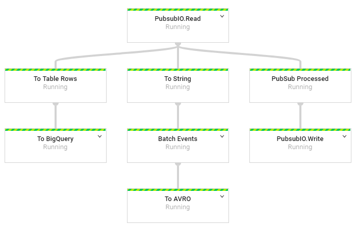
```

A third approach that can be used is sending raw events with additional attributes to another PubSub topic. A second DataFlow job can then be set up to parse events as needed. The code below shows how to parse raw events, add additional attributes to the PubSub message for filtering, and publish the events to a second topic. This approach enables event definitions to be changed without restarting the raw event pipeline.

&nbsp;
```{r eval=FALSE}
// topic for raw events with additional attributes 
private static String processed = 
  "projects/your_project_id/topics/processed-events";

events.apply("PubSub Processed", 
  ParDo.of(new DoFn<PubsubMessage, PubsubMessage>() {             
    
  @ProcessElement            
  public void processElement(ProcessContext c)  { 
    String msg = new String(c.element().getPayload());   
   
    // parse the JSON message for attributes 
    JsonObject jsonObject = new 
        JsonParser().parse(msg).getAsJsonObject(); 
    String eventType = jsonObject.get("eventType"); 
        
    // Add additional attributes for filtering 
    HashMap<String, String> atts = new HashMap();               
    atts.put("EventType", eventType);               
    PubsubMessage out = new PubsubMessage(
        msg.getBytes(), atts);
    c.output(out);                                                 
  }  
}))     
.apply(PubsubIO.writeMessages().to(processed));
```

A fourth approach that can be used is having downstream ETLs processes apply schemas to the raw events and break apart the raw events table into event specific tables. We'll cover this approach in the next chapter.

## Conclusion
This chapter has provided an introduction to building a data pipeline for a startup. We covered the types of data in a pipeline, desired properties of a high functioning data pipeline, the evolution of data pipelines, and a sample pipeline built on GCP.
The full source code for this sample pipeline is available on Github^[https://github.com/bgweber/GameAnalytics]. 

There is now a variety of tools available that make it possible to set up an analytics pipeline for an application with minimal effort. Using managed resources enables small teams to take advantage of serverless and autoscaling infrastructure to scale up to massive event volumes with minimal infrastructure management. Rather than using a data vendor's off-the-shelf solution for collecting data, you can record all relevant data for your app. While the approach presented here isn't directly portable to other clouds, the Apache Beam library used to implement the core functionality of this data pipeline is portable and similar tools can be leveraged to build scalable data pipelines on other cloud providers.
