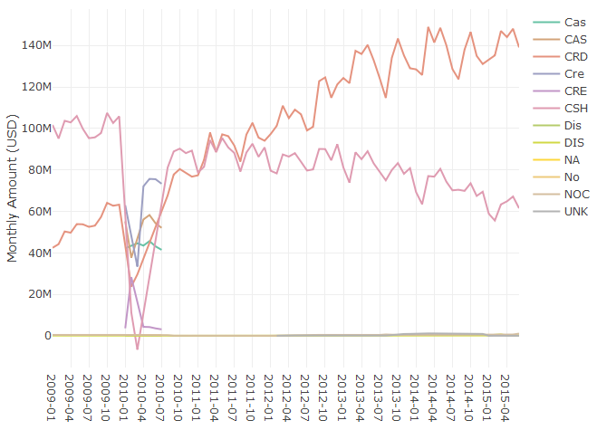
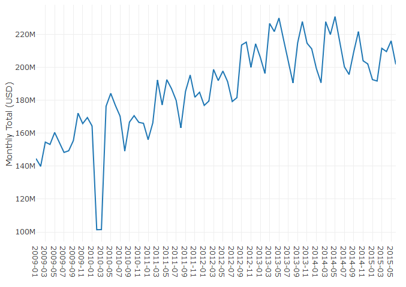
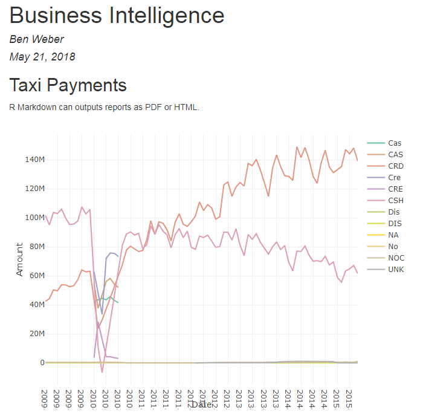
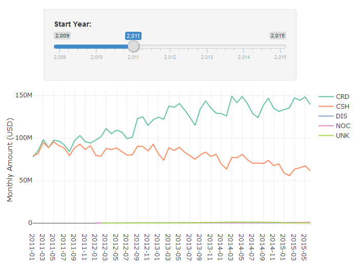
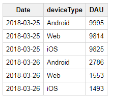
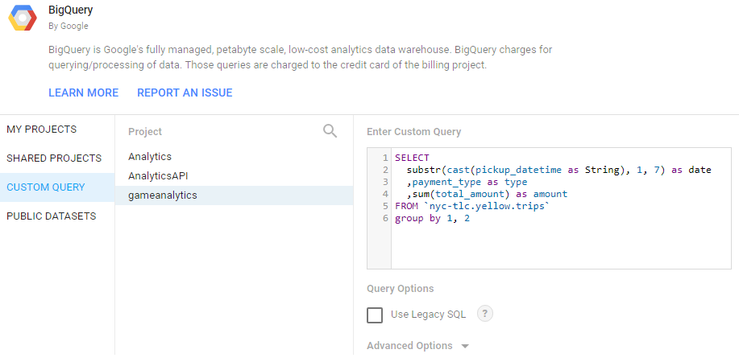
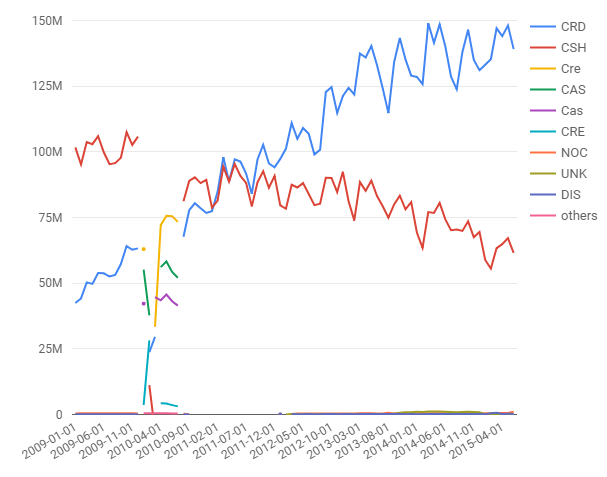
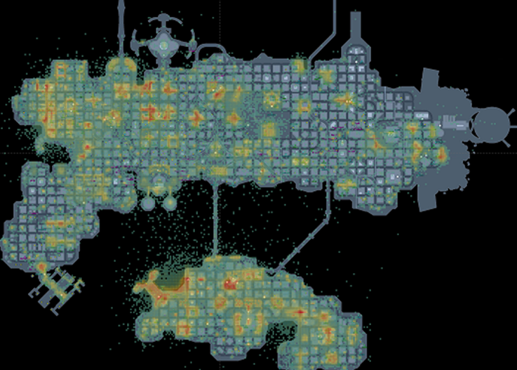
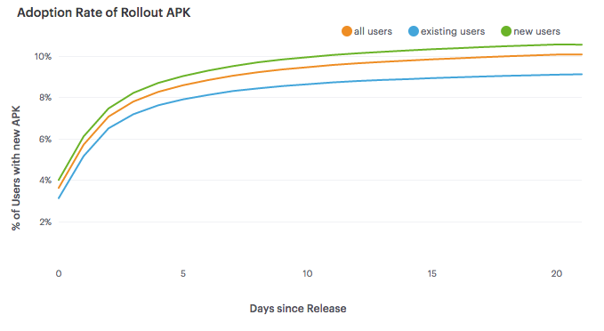
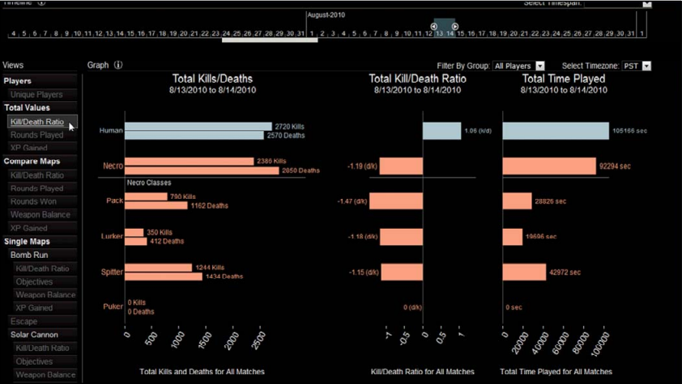

# Business Intelligence 
A lot of the heavy lifting involved in setting up data science at a startup is convincing the product team to instrument and care about data. If you're able to achieve this goal, the next step is being able to answer all sorts of questions about product health within your organization. A novice data scientist might think that this type of work is outside the role of a data scientist, but identifying key metrics for product health is one of the core facets of the role.

I've titled this chapter as business intelligence, because once you've set up a data pipeline, a data scientist in a startup is expected to answer every question about data. This is not surprising given the new flood of data, but also a time for a data scientist to set expectations for the rest of the organization. As a data scientist in a startup, your function is not to answer data questions, but to inform the leadership about what metrics should be important.

This chapter covers the basics of how to turn raw data into cooked data that can summarize the health of a product. I'll discuss a few different approaches to take when working with raw data, including SQL queries, R markdown, and vendor tools. The general takeaway is to show that several options are available for processing data sets, and you should choose a solution that fits the goals of your team. I'll discuss past experiences with tools such as Tableau, and provide recommendations for scaling automated reporting across a team.

We'll use two data sources for this chapter. The first is a public data set that we'll aggregate and summarize with key metrics. The second is data generated by the tracking API in the second chapter of this series. We'll focus on the second data set for transforming raw to processed data, and the first data set for processed to cooked data.

## KPIs
Key Performance Indicators (KPIs) are used to track the health of a startup. It's important to track metrics that capture engagement, retention, and growth, in order to determine if changes made to the product are beneficial. As the data scientist at a startup, your role has the responsibility of identifying which metrics are important.This function aligns with the data science competency of domain knowledge, and is one of the areas where a data scientist can be highly influential.

KPIs that are established by an early data scientist can have have a resounding impact. For example, many of the past companies I worked at had company goals based on past analyses of data scientists. At Electronic Arts we were focused on improving session metrics, at Twitch we wanted to maximize the amount of content watched, and at Sony Online Entertainment we wanted to improve retention metrics for free-to-play titles. These were game industry metrics, but there are more general metrics such as engagement, growth, and monetization that are important to track when building a company.

It's important when building a data science discipline at a startup to make sure that your team is working on high impact work. One of the problems I've seen at past companies is data scientists getting pulled into data engineering and analytics type of work. This is expected when there's only one data person at the company, but you don't want to support too many manual data processes that won't scale. This is why setting up reproducible approaches for reporting and analysis is important. It should be trivial to rerun an analysis months down the road, and it should be possible for another team member to do so with minimal direction.

My main advice for new data scientists to prevent getting overwhelmed with requests from product managers and other teams is to set up an interface to the data science team that buffers direct requests. Instead of having anyone at the company being able to ask the data science team how things are performing, a baseline set of dashboards should be set up to track product performance. Given that a data scientist may be one of the first data roles at a startup, this responsibility will initially lie with the data scientist and it's important to be familiar with a number of different tools in order to support this function at a startup.

## Reporting with R
One of the key transitions that you can make at a startup as a data scientist is migrating from manual reporting processes to reproducible reports. R is a powerful programming language for this type of work, and can be used in a number of different ways to provide automated reporting capabilities. This section discusses how to use R for creating plots, generating reports, and building interactive web applications. While many of these capabilities are also provided by Python and the Jupyter suite, the focus on automation is more important than the language used to achieve this goal.

It's possible to achieve some of this type of functionality with Excel or Google Sheets, but I would advise against this approach for a startup. These tools are great for creating charts for presentations, but not suitable for automated reporting. It's not sustainable for a data scientist to support a startup based on these types of reports, because so many manual steps may be necessary. Connectors like ODBC in Excel may seem useful for automation, but likely won't work when trying to run reports on another machine.

This section covers three approaches to building reports with R: using R directly to create plots, using R Markdown to generate reports, and using Shiny to create interactive visualizations. All of the code listed in this section is available on Github^[https://github.com/bgweber/StartupDataScience/tree/master/BusinessIntelligence].

### Base R
Consider a scenario where you are part of a NYC startup in the transportation sector, and you want to determine what type of payment system to use to maximize the potential of growing your user base. Luckily, there's a public data set that can help with answering this type of question: BigQuery's NYC Taxi and Limousine Trips public data set^[https://cloud.google.com/bigquery/public-data/nyc-tlc-trips]. This collection of trip data includes information on payments that you can use to trend the usage of payment types over time.

The first approach we'll use to answer this question is using a plotting library in R to create a plot. I recommend using the RStudio IDE when taking this approach. Also, this approach is not actually "Base R", because I am using two additional libraries to accomplish the goal of summarizing this data set and plotting the results. I'm referring to this section as Base R, because I am using the built-in visualization capabilities of R.

One of the great aspects of R is that there's a variety of different libraries available for working with different types of databases. 
The bigrquery library provides a useful connector to BigQuery that can be used to pull data from the public data set within an R script. The code for summarizing the payment history over time and plotting the results as a chart are shown below.

&nbsp;
```{r eval=FALSE}
library(bigrquery)
library(plotly)
project <- "your_project_id"
sql <- "SELECT  
  substr(cast(pickup_datetime as String), 1, 7) as date
  ,payment_type as type 
  ,sum(total_amount) as amount
FROM `nyc-tlc.yellow.trips`
group by 1, 2"
df <- query_exec(sql, project = project,
          use_legacy_sql = FALSE)
plot_ly(df, x = ~date, y = ~amount, 
          color = ~type) %>% add_lines() 
```

The first part of this script, which includes everything except for the last line, is responsible for pulling the data from BigQuery. It loads the necessary libraries, states a query to run, and uses bigrquery to fetch the result set. Once the data has been pulled into a data frame, the second part of the script uses the plotly library to display the results as a line chart. Some additional formatting steps have been excluded from the script, and the full code listing is available on Github. In RStudio, the chart will show up as an interactive plot in the IDE, and Jupyter provides similar functionality. The result of this code snippet is shown in the chart above.

```{r 4-1, echo=FALSE, out.width="100%", fig.cap="Monthly Spending by Payment"}

```

TypeThe query calculates the total monthly spend by payment type for taxi trips in NYC, using data from 2009 to 2015. The results show that credit cards (CRD) are now the preferred payment method over cash (CSH). To answer the initial question about what type of payment system to implement, I'd recommend starting with a system that accepts credit cards.

One topic worth bringing up at this point is data quality, since the chart has a number of different labels that seem to represent the same values. For example CAS and CSH both likely refer to cash payments and should be grouped together to get an accurate total of cash payments. Dealing with these types of issues is outside the scope of this approach, but there are a few methods that can be used for this type of scenario. The easiest but least scalable approach is to write queries that account for these different types:

&nbsp;
```{r eval=FALSE}
,sum(case when payment_type in ('CSH', 'CAS') 
       then amount else 0 end) as cash_payments
```

A different approach that can be used is creating a dimension table that maps all of the raw payment_type values to sanitized type values. This process is often called attribute enrichment, and is useful when building out cooked data sets from raw or processed data.

We've answered the first question about determining the most popular payment method, but what if we have a second question about whether or not the transportation market in NYC is growing? We can easily plot data to answer this question using the existing data:
  
&nbsp;
```{r eval=FALSE}
total <- aggregate(df$Amount, 
            by=list(Category=df$Date), FUN=sum)
plot_ly(total, x = ~Category, y = ~x) %>% add_lines()
```

This code computes the total monthly payments across all of the different payment types, and plots the aggregate value as a single line chart. The results are shown in the figure below. Based on the initial observation of this data, the answer to the second question is unclear. There's been a steady increase in taxi spending in NYC from 2009 to 2013, with seasonal fluctuations, but spending peaked in sum mer of 2014. It's possible that Uber and Lyft account for this trend, but further analysis is needed to draw a firm conclusion.

```{r 4-2, echo=FALSE, out.width="100%", fig.cap="Total Monthly Spending"}

```

This section has shown how to use R to generate plots from summarized data in BigQuery. While this sample used a fixed data set, the same approach could be used with a live data set that grows over time, and rerunning the script will include more recent data. This is not yet automated reporting, because it involves manually running the code in an IDE or notebook. One approach that could be used is outputting the plot to an image file, and running the script as part of a cron job. The result of this approach is an image of the plot that gets updated on a regular schedule. This is a good starting point, but there are more elegant solutions for automated reporting in R.

### R Markdown 
Let's say you want to perform the same analysis as before, but want to produce a report each time you run the script. R Markdown provides this capability, and can use R code to generate PDFs, word documents (DOCX), and web pages (HTML). You can even write books with R Markdown! R Markdown extends standard markdown to support inline R snippets that can be used to generate visualizations. The embedded R code can perform almost any standard R functionality, including using R libraries and making connections to databases. This means we can convert the code above into an R markdown file, and run the script regularly to build automated reporting.

The markdown snippet below is the previous R code now embedded in a report that will generate an HTML file as output. The first part of the file is metadata about the report, including the desired output. Next, markdown is used to add commentary to the report. And finally, a R code block is used to pull data from BigQuery and plot the results. The resulting plotly object is embedded into the document when running this report.

&nbsp;
````{r eval=FALSE}
---
title: "Business Intelligence"
output: html_document
---
## Taxi Payments 
R Markdown can outputs reports as PDF or HTML.

`` `{r echo=FALSE, message=FALSE, warning=FALSE}
library(bigrquery)
library(plotly)
project <- "your_project_id"
sql <- "SELECT  
  substr(cast(pickup_datetime as String), 1, 7) as date
  ,payment_type as type 
  ,sum(total_amount) as amount
FROM `nyc-tlc.yellow.trips`
group by 1, 2"
df <- query_exec(sql, project = project,
          use_legacy_sql = FALSE)
plot_ly(df, x = ~date, y = ~amount, 
          color = ~type) %>% add_lines() 
` ``
```

The resulting HTML document is shown in the figure below. It includes that same plot as before, as well as the markdown text listed before the code block. This output can be more useful than an image, because the plotly charts embedded in the file are interactive, rather than rendered images. It's also useful for creating reports with a variety of different charts and metrics.

```{r 4-3, echo=FALSE, out.width="100%", fig.cap="The report generated from the R Markdown file."}

```

To automate creating this report, you can again set up a cron job. The command for converting the Rmd file to a report is:

&nbsp;
```{r eval=FALSE}
Rscript -e "rmarkdown::render('BI.Rmd')"
```

We now have a way of generating reports, and can use cron to start building an automated reporting solution. However, we don't yet have charts that provide filtering and drill-down functionality.

### R Shiny
Shiny is a solution for building dashboards directly in R. It provides functionality for building reports with filtering and drill-down capabilities, and can be used as an alternative to tools such as Tableau. When using Shiny, you specify the UI components to include in the report and the behaviors for different components in a report, such as applying a filter based on changes to a slider component. The result is an interactive web app that can run your embedded R code.

I've created a sample Shiny application based on the same code as the above reports. The first part of the code is the same, we pull data from BigQuery to a dataframe, but we also include the shiny library. The second part of the code defines the behavior of different components (server), and the layout of different components (ui). These functions are passed to the shinyApp call to launch the dashboard.

&nbsp;
```{r eval=FALSE}
library(shiny)
library(bigrquery)
library(plotly)
project <- "your_project_id"
sql <- "SELECT  
substr(cast(pickup_datetime as String), 1, 7) as date
,payment_type as type 
,sum(total_amount) as amount
FROM `nyc-tlc.yellow.trips`
group by 1, 2"
df <- query_exec(sql, project = project, 
                 use_legacy_sql = FALSE)
server <- function(input, output) {
  output$plot <-  renderPlotly({
    plot_ly(df[df$date >= input$year, ], x = ~date, 
      y = ~amount, color = ~type) %>% add_lines()
  })
}
ui <- shinyUI(fluidPage(
  sidebarLayout(
    sidebarPanel(
      sliderInput("year", "Start Year:", 
        min = 2009, max = 2015, value = 2012)
    ),
    mainPanel(plotlyOutput("plot"))
  )
))
shinyApp(ui = ui, server = server)
```

The UI function specifies how to lay out the components in the dashboard. I started with the Hello Shiny example, which includes a slider and histogram, and modified the layout to use a plotlyOutput object instead of a plotOutput. The slider specifies the years to allow for selection, and sets a default value. The behavior function specifies how to respond to changes in UI components. The plot is the same as behavior, with one modification, it now filters on the starting data when using the data frame df\$date >= input\$year. The result is the interactive dashboard shown above. Moving the slider will now filter the years that are included in the chart.

```{r 4-4, echo=FALSE, out.width="100%", fig.cap="An interactive Chart in R Shiny."}

```

I've now shown three different ways to generate reports using R. If you need interactive dashboards, then Shiny is a great tool to explore, while if you're looking to build static reports, then R Markdown is a great solution. One of the key benefits of both of these approaches is that you can embed complex R logic within your charts, such as using Facebook's prophet library to add forecasted values to your charts.

## ETLs
In the chapter on data pipelines, I discussed using raw, processed, and cooked data. Most reports used for business intelligence should be based on cooked data, where data is aggregated, enriched, and sanitized. If you use processed or raw data instead of cooked data when building reports, you'll quickly hit performance issues in your reporting pipeline. For example, instead of using the nyc-tlc.yellow.trips table directly in the R section above, I could have created a table with the aggregate values precomputed.

ETL is an abbreviation of Extract-Transform-Load. One of the main uses of these types of processes is to transform raw data into processed data or processed data into cooked data, such as aggregation tables. One of the key challenges in setting up aggregates tables is keeping the tables updated and accurate. For example, if you started tracking cash payments using a new abbreviation (e.g. CAH), you would need to update the aggregation process that computes monthly cash payments to include this new payment type.

One of the outputs of the data pipeline is a raw events table, that includes data for all of the tracking events encoded as JSON. One of the types of ETL processes we can set up is a raw to processed data transformation. In BigQuery, this can be implemented for the login event as follows:

&nbsp;
```{r eval=FALSE}
create table tracking.logins as (
  select eventVersion,server_time 
    ,JSON_EXTRACT_SCALAR(message, '$.userID') userID
    ,JSON_EXTRACT_SCALAR(message, '$.deviceType') type
  from tracking.raw_events
  where eventType = 'Login'
)
```

This query filters on the login events in the raw events table, and uses the JSON extract scalar function to parse elements out of the JSON message. The result of running this DDL statement will be a new table in the tracking schema that includes all of the login data. We now have processed data for logins with userID and deviceType attributes that can be queried directly.

In practice, we'll want to build a table like this incrementally, transforming only new data that has arrived since the last time the ETL process ran. We can accomplish this functionality using the approach shown in the SQL code below. Instead of creating a new table, we are inserting into an existing table. With BigQuery, you need to specify the columns for an insert operation. Next, we find the last time when the login table was updated, represented as the updateTime value. And finally, we use this result to join on only login events that have occured since the last update. These raw events are parsed into processed events and added to the logins table.

&nbsp;
```{r eval=FALSE}
insert into tracking.logins
    (eventVersion,server_time, userID, deviceType)
with lastUpdate as (
  select max(server_time) as updateTime
  from tracking.logins
)
select eventVersion,server_time 
  ,JSON_EXTRACT_SCALAR(message, '$.userID') userID
  ,JSON_EXTRACT_SCALAR(message, '$.deviceType') type
from tracking.raw_events e
join lastUpdate l 
  on e.server_time > updateTime
where eventType = 'Login'
```

A similar approach can be used to create cooked data from processed data. The result of the login ETL above is that we now can query against the userID and deviceType fields directly. This processed data makes it trivial to calculate useful metrics such as daily active users (DAU), by platform. An example of computing this metric in BigQuery is shown below.

&nbsp;
```{r eval=FALSE}
create table metrics.dau as (
  select substr(server_time, 1, 10) as Date
    ,deviceType, count(distinct userID) as DAU
  from `tracking.logins` 
  group by 1, 2
  order by 1, 2
)
``` 

The result of running this query is a new table with the DAU metric precomputed. A sample of this data is shown in the Cooked Data table. Similar to the previous ETL, in practice we'd want to build this metric table using an incremental approach, rather than rebuilding using the complete data set. A slightly different approach would need to be taken here, because DAU values for the current day would need to be updated multiple times if the ETL is ran multiple times throughout the day.

```{r 4-5, echo=FALSE, out.width="50%", fig.align="center", fig.cap="Cooked Data: DAU by Platform."}

```

Once you have a set of ETLs to run for your data pipeline, you'll need to schedule them so that they run regularly. One approach you can take is using cron to set up tasks, such as:

&nbsp;
```{r eval=FALSE}
bq query --flagfile=/etls/login_etl.sql
```

It's important to set up monitoring for processes like this, because a failure early on in a data pipeline can have significant downstream impacts. Tools such as Airflow can be used to build out complex data pipelines, and provide monitoring and alerting.

## Reporting Tools
While R does provide useful tools for performing business intelligence tasks, it's not always the best tool for building automated reporting. This is common when reporting tools need to used by technical and non-technical users and vendor solutions for building dashboards are often useful for these types of scenarios. Here are a few of the different tools I've used in the past.

### Google Data Studio
 If you're already using GCP, then Google Data Studio is worth exploring for building dashboards to share within your organization. However, it is a bit clunkier than other tools, so it's best to hold off on building dashboards until you have a mostly complete spec of the reports to build.

```{r 4-6, echo=FALSE, out.width="100%", fig.cap="Setting up a Custom Data Source in Data Studio."}

```

The image above shows how to set up a custom query in Google Data Studio to pull the same data sets as used in the R reports. The same report as before, now implemented with Data Studio is shown below.

```{r 4-7, echo=FALSE, out.width="100%", fig.cap="The Taxi Report recreated in Google Data Studio."}

```

The main benefit of this tool is that it provides many of the collaboration features build into other tools, such as Google Docs and Google Sheets. It also refreshes reports as necessary to keep data from becoming stale, but has limited scheduling options available.

### Tableau
One of the best visualization tools I've used is Tableau. It works well for the use case of building dashboards when you have a complete spec, and well as building interactive visualizations when performing exploratory analysis. The heatmap for DC Universe Online was built with Tableau, and is one of many different types of visualizations that can be built.

```{r 4-8, echo=FALSE, out.width="100%", fig.cap="A heatmap in Tableau for the game DC Universe Online."}

```

The main benefit of Tableau is ease-of-use in building visualizations and exploring new data sets. The main drawback is pricing for licenses, and a lack of ETL tooling, since it is focused on presentation rather than data pipelines.

### Mode
At Twitch, we used a vendor tool called Mode Analytics. Mode made it simple to share queries with other analysts, but has a rather limited selection of visualization capabilities, and also was focused on only presentation and not ETL type tasks.

```{r 4-9, echo=FALSE, out.width="100%", fig.cap="Line Charts in Mode Analytics."}

```

###Custom Tooling
Another approach that can be used is creating custom visualizations using tools such as D3.js and Protovis. At Electronic Arts, D3 was used to create customer dashboards for game teams, such as the Data Cracker tool built by Ben Medler for visualizing playtesting data in Dead Space 2.
Using custom tooling provides the most flexibility, but also requires maintaining a system, and is usually substantially more work to build.

```{r 4-10, echo=FALSE, out.width="100%", fig.cap="The Data Cracker Tool for Dead Space 2. Source: GDC Vault 2011."}

```

## Conclusion
One of the key roles of a data scientist at a startup is making sure that other teams can use your product data effectively. Usually this takes the form of providing dashboarding or other automated reporting, in order to provide KPIs or other metrics to different teams. It also includes identifying which metrics are important for the company to measure.

This chapter has presented three different ways for setting up automated reporting in R, ranging from creating plots directly in R, using R Markdown to generate reports, and using Shiny to build dashboards. We also discussed how to write ETLs for transforming raw data to processed data and processed data to cooked data, so that it can be used for reporting purposes. And the last section discussed some different vendor solutions for reporting, along with tradeoffs.

After setting up tooling for business intelligence, most of the pieces are in place for digging deeper into data science type of work. We can move beyond retrospective types of questions, and move forward to forecasting, predictive modeling, and experimentation.
