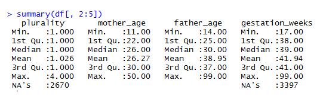
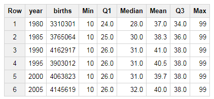
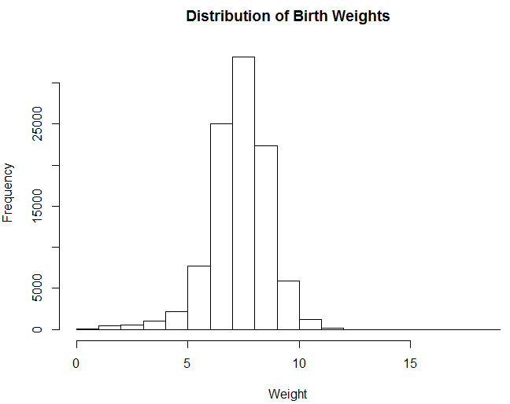
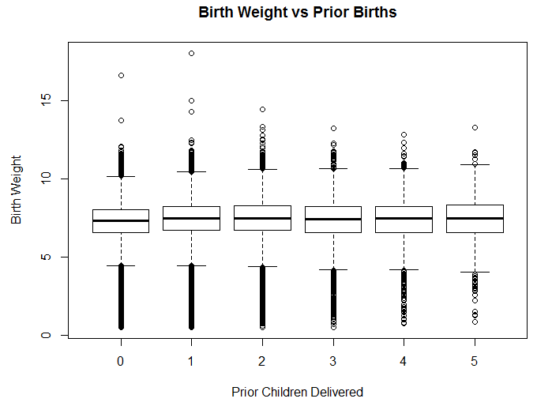
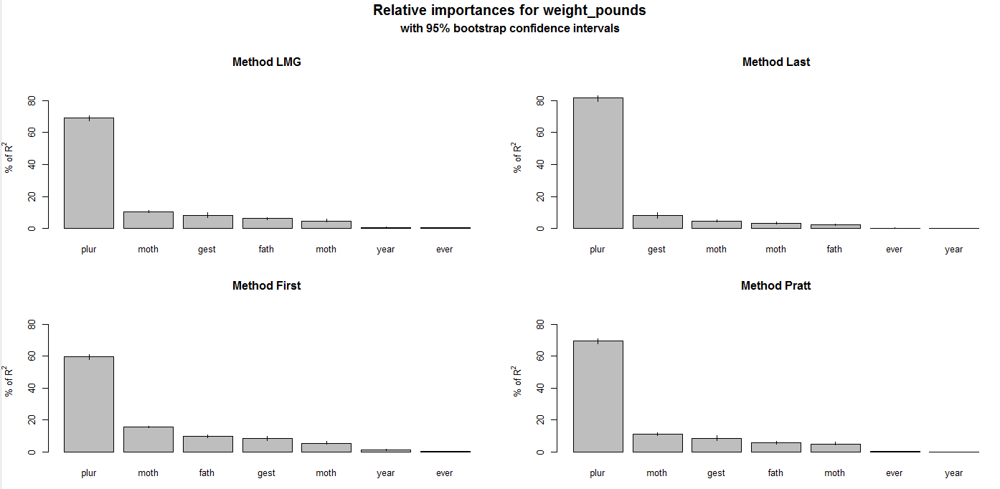

# Exploratory Data Analysis 
Once you’ve set up a data pipeline and collected data about user behavior, you can start exploring the data in order to determine how to improve your product. Exploratory Data Analysis (EDA) is the process of investigating a data set to understand the shape of the data, correlations between features, and signals in the data that may be useful for building predictive models.

It’s useful to be able to perform this task in both a query language and a scripting language. R provides useful tools for quickly understanding the shape of a data set, but can only analyze data sets that can fit in memory. To work with massive data sets, SQL is useful for computing summary stats and distributions across a complete data set.

This chapter presents four types of exploratory analyses, including computing summary statistics, plotting features, correlation analysis, and weighting feature importance for a simple linear model. The goal of performing this type of work is to be able to better understand user behavior, determine how to improve a product, and investigate if the data provides useful signals.

We’ll use the Natality BigQuery data set for the EDA examples. This data set provides information about births in the USA over the past 50 years. The goal of this analysis is to determine which factors are correlated with birth weight, and build a linear regression model to predict outcomes.

## Summary Statistics
The first thing we’ll want to do when exploring a new data set is computing summary statistics that help us understand the data set. This can include statistics such as the mean and median values, and well as extremes such as minimum and maximum values. R provides a function called summary that calculates these statistics for every column in a data frame. An example using this function is shown in the code snippet below.

&nbsp;
```{r eval=FALSE}
library(bigrquery)
project <- "your_project_id"
sql <- "
 SELECT year, plurality, mother_age, father_age,    
       gestation_weeks, ever_born, 
       mother_married, weight_pounds
 FROM `bigquery-public-data.samples.natality`
 order by rand() 
 LIMIT 100000"
df <- query_exec(sql, project = project, 
                 use_legacy_sql = FALSE)
summary(df[, 2:5])
```

The script queries the Natality data set in BigQuery and pulls a sample data set locally. Next, the second through fifth columns of the result set are passed to the summary function. The result of calling this function is shown in the figure below. For each of the columns, the function calculations min, mean, max values, and the 25th, 50th, and 75th percentiles for each attribute. It also counts the number of instances of missing (NA) values.

```{r 5-1, echo=FALSE, out.width="100%", fig.cap="Summary Stats for the Natality Data Set."}

```

Summary provides a quick way of understanding a data set, but usually requires further digging to really understand the shape of the data. The next section shows how to use histograms to build a more complete understanding of a data set. One of the interesting features in the data set is the plurality column, which describes the number of children carried as part of the pregnancy (litter size). The median is slightly above 1, because of the rare occurrence of twins, triples, or even more children. Due to the skewness of this distribution, the summary stats do not provide a good overview of how common twins or triplets are in human pregnancies.

To find out how common twins and triplets are we can use the sqldf library, which enables queries to be performed on R data frames. The code below shows how to count the number of pregnancies that result in multiple children being delivered. The results show that twins have a frequency of about 2.4%, triplets occur in about 0.1% of pregnancies, and quadruplets have a frequency of about 0.009%.

&nbsp;
```{r eval=FALSE}
library(sqldf)
df <- df[!is.na(df$plurality), ]
sqldf("select plurality, sum(1) as Babies 
from df group by 1
order by 1")
```

These results are based on a sample of 1,000,000 pregnancies. Ideally, we want to calculate these statistics across our compute data set. Aggregate values such as min, max, and mean are easy to compute, because SQL has aggregations for these operations built-in. However, calculating the median and 25th and 75th percentiles is often non trivial. If you try to apply the percentile_cont operation to the complete data set of 138M pregnancies, BigQuery will throw an exception, because this is an analytic function that will shuffle all of the records to a single node.

There’s a few different approaches to work around this limitation. BigQuery does provide an approximate quantiles function that will support this size of data. You can also partition the data set using a randomly generated value, such as rand()*10 and take the average, to get an approximate result. These approaches work well for the 25th, 50th, and 75th percentile values, but are not as accurate for extreme results, such as the 99.9th percentile. A third approach is to provide a partition key to split up the data, preventing too much data from being shuffled to a single machine. We can use the year field, as shown in the following query.

&nbsp;
```{r eval=FALSE}
select year, sum(1) births, min(father_age) Min
  ,avg(Q1) Q1, avg(Q2) Median
  ,round(avg(father_age), 1) Mean
  ,avg(Q3) Q3, max(father_age) Max
from (
  select year, father_age
   ,percentile_cont(father_age, 0.25) 
        over (partition by year) as Q1
   ,percentile_cont(father_age, 0.50) 
        over (partition by year) as Q2
   ,percentile_cont(father_age, 0.75) 
        over (partition by year) as Q3
  FROM `bigquery-public-data.samples.natality`
  where mod(year, 5) = 0 and year >= 1980
)
group by 1 order by 1
``` 

This approach calculates the 25th, 50th, and 75th percentiles for the father_age column. The percentile_cont function is an analytic function, meaning that it returns a result for every record, and needs to be aggregated to create a summary statistic. The query above shows how to compute the same statistics provided by the R summary function using BigQuery, while partitioning the data by the year of the birth. This query generates the following table, which shows statistics about the father age.

```{r 5-2, echo=FALSE, out.width="80%", fig.align="center", fig.cap="Birth Summary Statistics by Year (Father Age)."}

```

There’s a few interesting trends in this data worth noting. The first is the consistent value of 99 years, as the maximum father age. This is likely a data quality issue, and 99 may be set as the age when the age of the father is unknown. Another trend is that the median father age has been increasing over the years, from 28 in 1980 to 32 in 2005. This isn’t normalized for the first child, but the summary statistics do indicate a trend that families are starting to have children later in life.

## Plotting
Summary statistics provide a quick way of getting a snapshot of a data set, but often don’t provide a good overview of how data is distributed. To build a more complete understanding of the shape of a data set, its useful to plot data in various ways, such as using histograms.

&nbsp;
```{r eval=FALSE}
hist(df$weight_pounds, main = "Distribution of Weights"
    ,xlab = "Weight")
```

The R code above shows how to plot a histogram of the birth weights in our sampled data set. The result is the following histogram, which seems to indicate that the value is normally distributed. The majority of births weights are between 6 and 9 pounds.

```{r 5-3, echo=FALSE, out.width="80%", fig.align="center", fig.cap="Distribution of Birth Weights."}

```

&nbsp;
```{r eval=FALSE}
plot(ecdf(df$weight_pounds), main = "CDF of Weights",
    xlab = "Weight", ylab = "CDF")
```

Histograms are useful for visualizing distributions, but they do have a number of problems, such as the number of buckets influencing whether the distribution is unimodal vs bimodal. It’s also usually difficult to determine percentiles directly from a histogram. One type of visualization that works better for conveying this type of information is the cumulative distribution function (CDF). The code above shows how to visualize the same data, but uses a CDF.

The code applies the empirical cumulative distribution function, which is similar to computing the running sum and dividing by the total number of instances in the data set. One of the key benefits of CDF plots is that you can directly read percentile values from the visualization. Both types of visualizations can be generated using SQL and then plotting the results in a tool like Excel, but histograms are usually computationally less expensive, since they do not require analytic functions.

```{r 5-4, echo=FALSE, out.width="80%", fig.align="center", fig.cap="The same data, plotted as a CDF."}
knitr::include_graphics("images/5-4.png")
```

Another useful trick to explore when investigating data sets is transforming features, such as applying a log transform. This is useful when a data set is not normally distributed. For example, session data is usually a single-sided distribution with a long tail, and applying a log transform often provides a better summarization of the data when plotted.

&nbsp;
```{r eval=FALSE}
hist(df$gestation_weeks, main = "Gestation Weeks", 
     xlab = "Weeks")
hist(log(df$gestation_weeks), main = "Gestation 
     Weeks (Log Transform)", xlab = "log(Weeks)")
``` 

The code above shows how to transform the gestation weeks feature with a log transform. This is useful for distributions with long tails, and only positive values. The code generates the following two plots, which show similar results. For this example the transformation was not useful, but it’s a trick worth exploring when you need to fit data from a skewed distribution to something closer to a normal distribution. You can also apply a square root transformation to generate useful plots.

```{r 5-5, echo=FALSE, out.width="100%", fig.cap="Log Transforming Gestation Weeks."}
knitr::include_graphics("images/5-5.png")
```

An alternative to CDFs that conveys information about percentiles directly is box plots. Box plots show the 25th, 50th, and 75th percentiles, as well as interquartile ranges and outliers. This type of plot is often useful when comparing median values across different partitions of data.

&nbsp;
```{r eval=FALSE}
sample <- df[df$ever_born <= 6, ]
sample$ever_born <- sample$ever_born - 1 
boxplot(weight_pounds~ever_born,data=sample, 
        main="Birth Weight vs Prior Births", 
        xlab="Prior Children", ylab="Birth Weight")
```

An example of creating a box plot in R is shown in the code snippet above. This code creates a plot of different quartiles ranges, based on the number of previous children delivered by the mother. There’s no strong pattern indicated by this plot, but it does look like the first child delivered has a slightly lower weight than the following children delivered by a mother.

```{r 5-6, echo=FALSE, out.width="100%", fig.cap="Birth weight based on number of previous children."}

```

Another type of useful visualization is scatter plots, which compare the values of two different features in a data set. Scatter plots are useful for showing whether two features are strongly or weakly correlated. The R code below shows how to plot a comparison of the gestation period and birth weight. I’ve filtered out values with gestations periods longer than 90 weeks, because these are suspect.

&nbsp;
```{r eval=FALSE}
sample <- df[1:10000, ]
sample <- sample[sample$gestation_weeks < 90, ]
plot(sample$gestation_weeks, sample$weight_pounds, 
      main = "Birth Weight vs Gestation Weeks",
      xlab= " Gestation Weeks", ylab = "Birth Weight")
```

The results are shown in the following visualization. It’s clear from this plot that significantly shorter gestation periods result in lower birth weights, but it’s unclear how strong the correlation is for periods longer than 35 weeks. Overall, the features have an R-squared value of 0.25 for the sample data set. In order to determine which features are correlated with birth weights, we’ll need to use different methods discussed in the next section.

```{r 5-7, echo=FALSE, out.width="100%", fig.cap="A comparison of the gestation period and birth weight."}
knitr::include_graphics("images/5-7.png")
```


## Correlation Analysis
It’s useful to know if certain features are predictive of other values in a data set. For example, if we know that users that use a certain product feature are retained longer than other users, it provides useful insight into product development. Correlation analysis helps to understand which features are correlated within a data set. Each feature is compared with all other features in a data set. However, often the goal is to understand only the correlation between a single feature, rather than a complete matrix of comparisons.

It’s also important to avoid coming to strong conclusions based on only correlation analysis, because it’s not possible to establish causality. Usually the more dedicated users will explore more of the options provided by an application, so trying to drive users to perform a specific action is not going to necessarily increase retention. For example, it’s common to see improved retention for users that add social connections within an application, but driving users to add a friend in an application might not result in the desired outcome of longer user retention. It’s best to experiment using controlled methodologies, which I’ll discuss in alater chapter.

R has a built in function for performing correlation analysis. The cor function computes the correlation between all of the different columns in a data frame, using a specified methodology. The pearson method is useful when dealing with continuous values, and the spearman method is useful when using discrete values, such as survey data. An example of computing a correlation matrix is shown in the R snippet below.

&nbsp;
```{r eval=FALSE}
res <- cor(df, method = "pearson",use = "complete.obs")
res <- ifelse(res > 0, res^.5, -abs(res)^.5)
library(corrplot)
corrplot(res, type = "upper", order = "hclust")
```

To visualize the results, I’ve included the corrplot library, which creates a plot of the matrix. I noticed that the correlations between different features in the data set were weak, so I applied a square root transformation to make the results more readable. The resulting plot is shown in the figure below. As noted earlier, the gestation period is not the strongest factor in determining birth weight. The plurality is actually the strongest predictor of weight.

```{r 5-8, echo=FALSE, out.width="100%", fig.cap="Correlation Matrix for the Natality Data Set (R-values have been square-rooted for visibility)."}
knitr::include_graphics("images/5-8.png")
```

Similar to plotting histograms, it’s useful to try different transformations of features when calculating correlations. For example, when predicting housing prices, the log transform of the square footage of a home is often a stronger indicator of the home value than the raw square footage value.

## Feature Importance
Often the goal in exploring a data set is to determine which features are useful for predicting an outcome. This is similar to correlation analysis, but instead of evaluating the impact of each feature in isolation, the goal is to determine the significance of a single feature when including all other features. Correlation analysis is a way of understanding the marginal effect of a feature, and feature importance is a way of understanding the unique effect of a feature. This is useful for dealing with heavily correlated features, such as number of sessions versus total session length. Both are likely correlated with user retention, but one feature will be a stronger indicator than the other. LIME is a generalization of this type of analysis worth exploring.

While the next chapter will cover predictive modeling in more detail, we’re going to use a simple linear model here to show how to perform feature analysis. Our goal for this example is to predict birth weight, which is a continuous feature. Given this problem specification, regression is a good fit for predicting outcomes. We can build a linear regression model, and then evaluate the importance of different features in the model to determine which factors are strong predictors of the outcome. The following code example shows how to build a linear regression model in R, and to measure the importance of features using different methods.

&nbsp;
```{r eval=FALSE}
library(relaimpo)
fit <- lm(weight_pounds ~ . , data = df)
boot <- boot.relimp(fit, b = 10, 
    type = c("lmg", "first", "last", "pratt"), 
    rank = TRUE, diff = TRUE, rela = TRUE)
booteval.relimp(boot) 
plot(booteval.relimp(boot,sort=TRUE))
```

The results of this script are shown in the plots below. Different approaches are used to weight the features, and all of these methods show that plurality is the strongest feature in determining birth weight. The script first fits a linear regression model by specifying weight_points as the target value, and then uses the relative importance library to determine which features are significant in determining the outcome.

```{r 5-9, echo=FALSE, out.width="100%", fig.cap="Feature Weighting for the Natality data set."}

```

## Conclusion
Exploratory data analysis is one of the key competencies of a data scientist at a startup. You should be able to dig into a new data set and determine how to improve your product based on the results. EDA is a way of understanding the shape of a data set, exploring correlations within the data, and determining if there’s a signal for modeling an outcome based on the different features.

Exploratory analysis often involves some lightweight modeling to determine the importance of different features within a data set. In the next chapter, we’ll dig into predictive modeling, which focuses on estimating outcomes based on a number of different features.
