# Predictive Modeling
Machine learning can be used to make predictions about the future. You provide a model with a collection of training instances, fit the model on this data set, and then apply the model to new instances to make predictions. Predictive modeling is useful for startups, because you can make products that adapt based on expected user behavior. For example, if a viewer consistently watches the same broadcaster on a streaming service, the application can load that channel on application startup. Predictive models can also be used to build data products, such as a recommendation system that could recommend new broadcasters to the viewer.

This chapter provides a light introduction to predictive modeling with machine learning. I’ll discuss the different types of prediction problems and introduce some of the commonly used approaches, present approaches for building models using open tools and scripting languages, and provide an applied example of clustering. The goal for this chapter isn’t to provide an in-depth understanding of specific methods, but to show how a variety of tools can be used to quickly prototype different types of models.

## Types of Predictive Models
Machine learning models typically fail into two categories: supervised learning and unsupervised learning. For supervised problems, the data being used to fit a model has specified labels, or target variables. For example, if the goal is to identify which users in a mobile game are likely to become purchasers, we can use transaction data from past users as labels, where 1 means a paid user and 0 means a free user. The label is used as input to the supervised algorithm to provide feedback when fitting the model to a training data set. Classification and regression algorithms are two types of supervised learning. In a classification task, the goal is to predict the likelihood of an outcome, such as whether or not a mobile game user will make a purchase. For regression, the goal is to predict a continuous variable, such as the price of a home given a description of different features.

For unsupervised problems, no explicit labels are provided for training a model. The most common type of unsupervised learning method is clustering, which infers labels by forming groups of different instances in a data set. Clustering is useful for answering segmentation questions, such as what are the different archetypes of users that a product should support.

There are two other types of machine learning models that I won’t discuss here: semi-supervised learning and reinforcement learning. Semi-supervised learning is a process that identifies target labels as part of the training process, and is often implemented with autoencoders in deep learning. Reinforcement learning is a model that is updated based on a reward policy, where the actions taken by a model provide positive and negative feedback signals and are used to update the model.

For a startup, you’re likely going to get started with classification and regression models, which are often referred to as classic, or shallow machine learning problems. There’s a wide variety of different approaches that can be used. Some common approaches for classification are logistic regression, naive bayes, decision trees, and ensemble methods such as random forests and XGBoost. Common approaches for regression include many of the same approaches as classification, but linear regression is used in place of logistic regression. Support vector machines were popular back when I was in grad school a decade ago, but now XGBoost seems to be the king of shallow learning problems.

It’s important to know how different algorithms are implemented, because if you want to ship a predictive model as part of a product, it needs to be reliable and scalable. Generally, eager models are preferred over lazy models when shipping products. Eager models are approaches that generate a ruleset as part of the training process, such as the coefficients in a linear regression model, while a lazy model generates the rule set at run time. For example, a nearest neighbor (k-NN) model is a lazy approach. Lazy methods are often useful for building online learning systems, where the model is frequently updated with new data while deployed, but may have scalability issues.

How the performance of a predictive model is evaluated depends on the type of problem being performed. For example, metrics such as mean absolute error (MAE), root-mean squared error (RMSE), and correlation coefficients are useful for evaluate regression models, while ROC area under the curve (AUC), precision, recall, and lift are useful for classification problems.

## Training a Classification Model
This section presents a few different approaches that can be used to build a classification model. We’ll use the same data set as the past chapter on EDA, but instead of predicting birth weights in the Natality data set, we’ll attempt to predict which pregnancies will result in twins instead of singletons.

To start, we’ll need to pull a data set locally that we can use as input to different tools. The R code below shows how to sample 100k pregnancies and save the data frame to a CSV. This query is similar to the one from the past chapter, but I’ve included additional constraints in the where clause to avoid pulling records with missing (NA) values.

&nbsp;
```{r eval=FALSE}
library(bigrquery)
project <- "your_project_id"
options(stringsAsFactors = FALSE)

sql <- "SELECT year, mother_age
 ,father_age, gestation_weeks
 ,case when ever_born > 0 then ever_born 
     else 0 end as ever_born
 ,case when mother_married then 1 
     else 0 end as mother_married
 ,weight_pounds
 ,case when plurality = 2 then 1 else 0 end as label
FROM `bigquery-public-data.samples.natality`
where plurality in (1, 2) 
  and gestation_weeks between 1 and 90
  and weight_pounds between 1 and 20
order by rand() 
LIMIT 100000"

df <- query_exec(sql, project = project, 
                 use_legacy_sql = FALSE)
write.csv(df, "natality.csv", row.names = FALSE)
```

One of the challenges with this data set is that there are way more negative examples in this data set than there are positive examples. Only 2.4% of the pregnancies in the sampled data set have a label of ‘1’, indicating twins. This means we’ll need to use metrics other than accuracy in order to gauge the performance of different approaches. Accuracy is not a good metric for problems with a large class imbalance such as this one, because predicting a label of 0 for every record results in an accuracy of 97.6%. Instead, we’ll use the AUC curve metric for evaluating different models, since it’s useful for handling problems with imbalanced classes.

Another consideration when evaluating different models is using different training, test, and holdout data sets. The holdout data set is withheld until the end of the model training process, and used only once for evaluation. Training and test data sets can be used as frequently as necessary when building and tuning a model. Methods such as 10-fold cross validation are useful for building robust estimates of model performance. This is typically the approach I take when building models, but for the sake of brevity is not covered in all of the different examples below.

### Weka
One of the tools that I like to use for exploratory analysis and evaluating different modeling algorithms is Weka^[https://www.cs.waikato.ac.nz/ml/weka/], which is implemented in Java and provides a GUI for exploring different models. It’s a bit dated now, but I still find it quite useful for quickly digging into a data set and determining if there’s much of a signal available for predicting an outcome.

```{r 6-1, echo=FALSE, out.width="100%", fig.cap="Visualizing different features in the data set with Weka."}
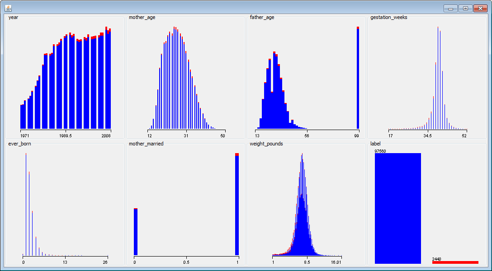
```

The chart above shows visualizations of different features in the data set. The red data points represent the positive examples (twins), and the blue data points represent negative examples (singletons). For features with a strong signal, it’s often possible to draw a vertical line that separates most of the red and blue data points. This isn’t the case with this data set, and we’ll need to combine different features to build a good classifier.

I used Weka to explore the following algorithms and to compute AUC metrics when using 10-fold cross validation:

- **Logistic:** 0.892
- **LogitBoost:** 0.908

The best performing algorithm out of the ones I explored was LogitBoost. This algorithm has a number of hyperparameters, such as number of iterations, that be be tuned to further improve the performance of the model. There may be other algorithms in Weka that work even better on this data set, but our initial exploration has resulted in promising results.

```{r 6-2, echo=FALSE, out.width="100%", fig.cap="Visualizing the ROC Curve with Weka."}
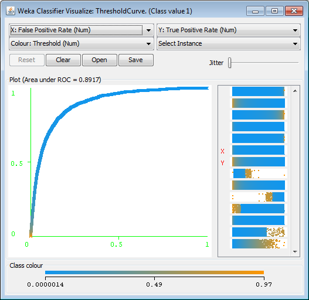
```

A visualization of the ROC curve for the logistic regression model is shown in the figure above. It’s also possible to explore the importance of different features in a logistic regression model with Weka. You can inspect the coefficients of the model directly. For example, weight_pounds has the highest coefficient value of 0.93. It’s also possible to use the InfoGain attribute ranker to determine which features are most important for this classification task. Weka found that weight_pounds (0.0415) was the most influential feature, followed by gestation_weeks (0.0243).

Weka is usually not the best choice for productizing models, but it does provide a useful tool for exploring a wide variety of different algorithms.

### BigML
Another tool that I’ve used in my startup experience is BigML^[https://bigml.com/]. This tool is similar to Weka in that it provides a GUI (web-based) for exploring different types of models without requiring any coding. The tool has fewer options than Weka, but has more recent models such as DeepNets.

```{r 6-3, echo=FALSE, out.width="100%", fig.cap="Evaluating Feature Importance in a Logistic Model with BigML."}
knitr::include_graphics("images/6-3.png")
```

The image above shows one of the feature importance tools provided by BigML. These tools are useful for understanding which features are useful in predicting an outcome. I explored two different models with BigML, resulting in the following AUC metrics:

- **Logistic:** 0.890
- **DeepNet:** 0.902

Instead of using 10-fold cross validation, I used a single 80/20 split of the data to evaluate the different models. The performance of the models in BigML was similar to Weka, but did not quite match the performance of LogitBoost.

```{r 6-4, echo=FALSE, out.width="100%", fig.cap="Evaluation Metrics provided by BigML."}
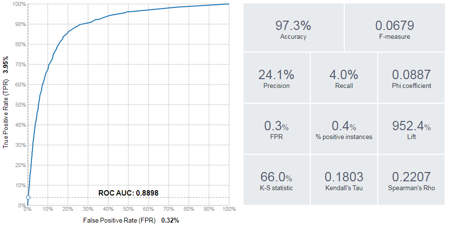
```

In addition to plotting ROC curves, as shown above, BigML can plot other useful visualizations such as lift charts. BigML also provides useful classification metrics such as precision, recall, and F1 score.

### R — Glmnet 
We can implement the logistic regression model that we’ve already evaluated using the glm library in R. The generalized linear models function can be applied to logistic regression by specifying the binomial family as input. R code that loads the CSV and trains a logistic regression model is shown below.

&nbsp;
```{r eval=FALSE}
df <- read.csv("Natality.csv")
fit <- glm(label ~ .,family=binomial(), data=df)
fit

library(Deducer)
rocplot(fit)
```

After fitting the model, the fit statement outputs the coefficients of the model. To evaluate the performance of the model, I used the Deducer library, which includes an rocplot function. For this basic model fitting approach, I did not perform any cross validation. The result was an AUC of 0.890 on the training data set.

```{r 6-5, echo=FALSE, out.width="100%", fig.cap="ROC Curve for the logistic regression model in R."}
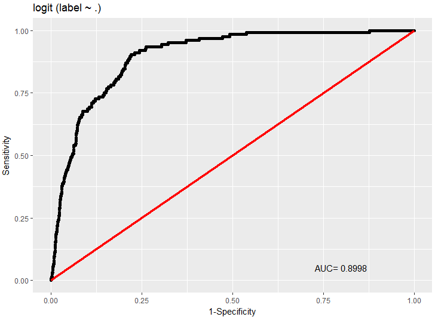
```

To use regularization when fitting a logistic regression model in R, we can use the glmnet library, which provides lasso and ridge regression. An example of using this package to evaluate feature importance is shown in the code below:

&nbsp;
```{r eval=FALSE}
library(glmnet)
x <- sparse.model.matrix(label ~ ., data = df)
y <- as.factor(df$label)

fit = glmnet(x, y, family = "binomial")
plot(fit, xvar = "dev", label = TRUE)
```

By default, the “least squares” model is used to fit the training data. The chart below shows how the coefficients of the model vary as additional factors are used as input to the model. Initially, only the weight_pounds features is used as input. Once this term begins getting penalized, around the value of -0.6, additional features are consider for the model.

```{r 6-6, echo=FALSE, out.width="100%", fig.cap="Feature weights based on different lambda values for glmnet."}
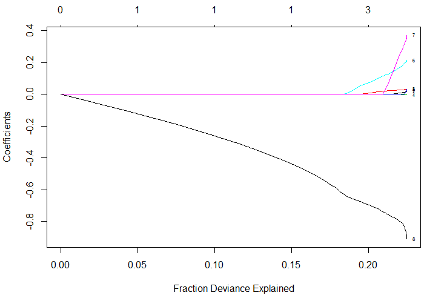
```

&nbsp;
```{r eval=FALSE}
cvfit = cv.glmnet(x, y, family = "binomial", 
                  type.measure = "auc")
cat(paste("ROC:", max(cvfit$cvlo)))
plot(cvfit)
```

The glmnet package provides a built-in cross validation feature that can be used to optimize for different metrics, such AUC. The R code above shows how to train a logistic regression model using this feature, and plots the outcome in the figure shown below. The AUC metric for the regularized logistic regression model was 0.893.

```{r 6-7, echo=FALSE, out.width="100%", fig.cap="Performance (AUC) of the glmnet model based on different lambda values."}
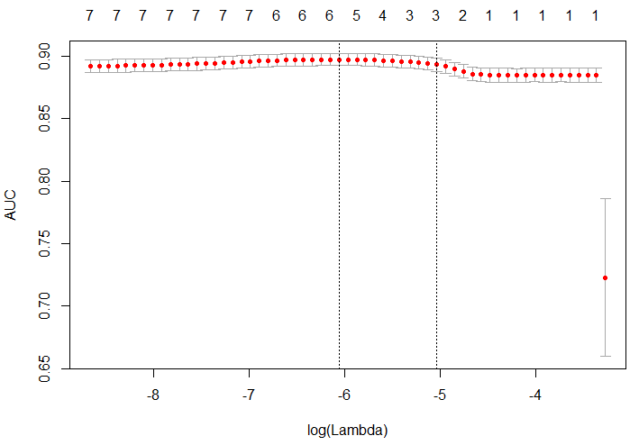
```

### Python — scikit-learn
Another tool that I wanted to cover in this section is scikit-learn, because it provides a standardized way of exploring the accuracy of different types of models. I’ve been focused on R for model fitting and EDA so far, but the Python tooling available through scikit-learn is pretty useful.

&nbsp;
```{r eval=FALSE}
# load the data set
import pandas as pd
df = pd.read_csv('./Natality.csv')

# build a random forest classifier 
from sklearn.ensemble import RandomForestClassifier
rf = RandomForestClassifier()
x = df.drop('label', axis=1)
y = df['label']
rf.fit(x, y)

# evaluate the results 
from sklearn.metrics import roc_curve, auc
false_positive_rate, true_positive_rate, _ = 
  roc_curve(y, rf.predict(x))
roc_auc = auc(false_positive_rate, true_positive_rate)

# plot the curve
import matplotlib.pyplot as plt
plt.plot(false_positive_rate, true_positive_rate, 
    'b', label='AUC = %0.2f'% roc_auc)
plt.legend(loc='lower right')
plt.show()
```

The Python code above shows how to read in a data frame using pandas, fit a random forest model using sklearn, evaluate the performance of the model, and plot the results, as shown in the figure below. 

```{r 6-8, echo=FALSE, out.width="70%", fig.align="center", fig.cap="ROC Curve for the RF model in scikit-learn."}
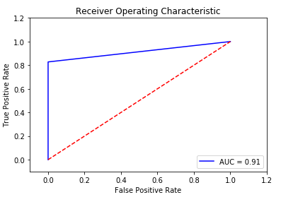
```

## Clustering
One of the types of analysis that is useful for startups is understanding if there’s different segments, or clusters of users. The general approach to this type of work is to first identify clusters in the data, assign labels to these clusters, and then assign labels to new records based on the labeled clusters. This section shows how to perform this type of process using data from the 2016 Federal Reserve Survey of Consumer Finances^[https://www.federalreserve.gov/econres/scfindex.htm].

The survey data set provides a breakdown of assets for thousands of households in the US. The goal of this clustering exercise is to identify if there are different types of affluent households, with a net worth of $1M+ USD. The complete code to load the data and perform the analysis is provided in the Jupyter notebook online^[https://bit.ly/2kp5ANb]. Prior analysis with this data set is presented my prior blog post^[https://bit.ly/2koWEHi].

For each of the surveyed households, we have a number of columns that specify how assets are allocated for the household, including residential and commercial real estate, business equity, retirement, and many other assets. The first thing we want to do is determine which assets have strong signals for clustering users. We can use PCA, and a factor map to accomplish this goal:

&nbsp;
```{r eval=FALSE}
# filter on affluent households
affluent <- households[households$netWorth >= 1000000,]
cat(paste("Affluent: ", floor(sum(affluent$weight))))

# plot a Factor Map of assets 
fviz_pca_var(PCA(affluent,  graph = FALSE), 
  col.var="contrib",    gradient.cols = c("#00AFBB", 
  "#E7B800", "#FC4E07"), repel = TRUE)+
  labs(title="Affluent Households - Assets Factor Map")
``` 

The results plotted below show that there are a few different assets groups that vary across affluent households. The most significant factor is business equity. Some other groupings of factors include investment assets (STOCKS, BONDS) and real estate assets/retirement funds.

```{r 6-9, echo=FALSE, out.width="100%", fig.cap="A factor map showing differences in asset allocations."}
knitr::include_graphics("images/6-9.png")
```

### How many clusters to use?
We’ve now shown signs that there are different types of millionaires, and that assets vary based on net worth segments. To understand how asset allocation differs by net worth segment, we can use cluster analysis. We first identify clusters in the affluent survey respondents, and then apply these labels to the overall population of survey respondents.

&nbsp;
```{r eval=FALSE}
k <- 7
res.hc <- eclust(
  households[sample(nrow(households), 1000), ],
  "hclust", k = k, graph = FALSE) 
fviz_dend(res.hc, rect = TRUE, show_labels = FALSE)
```

To determine how many clusters to use, I created a cluster dendrogram using the code snippet above. The result is the figure shown below. I also varied the number of clusters, k, until we had the largest number of distinctly identifiable clusters.

```{r 6-10, echo=FALSE, out.width="100%", fig.cap="A hierarchical visualization of the cluster assignments."}
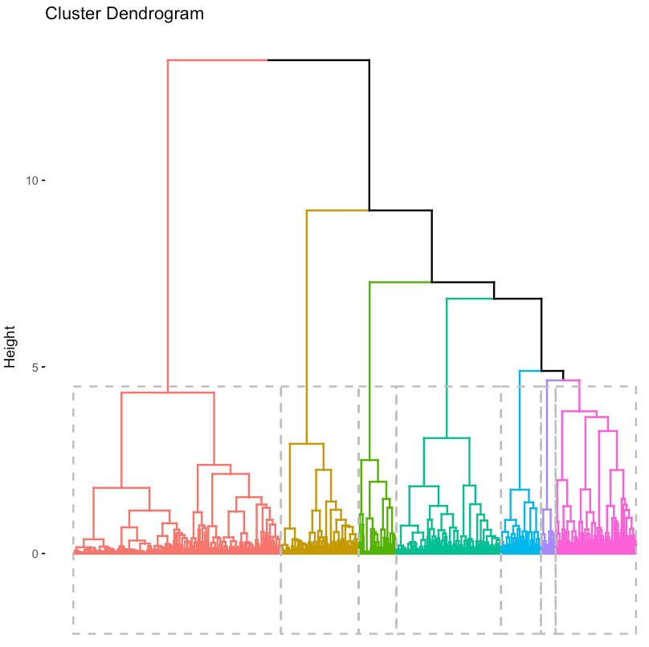
```

If you’d prefer to take a quantitative approach, you can use the fviz_nbclust function, which computes the optimal number of clusters using a silhouette metric. For our analysis, I decided on 7.

&nbsp;
```{r eval=FALSE}
clarax <- clara(affluent, k)
fviz_cluster(clarax, stand = FALSE, 
             geom = "point", ellipse = F)
```

To cluster the affluent households into unique groupings, I used the CLARA algorithm. A visualization of the different clusters is shown below. The results are similar to PCA and the factor map approach discussed above.

```{r 6-11, echo=FALSE, out.width="100%", fig.cap="A visualization of the two-principal components identified by PCA."}
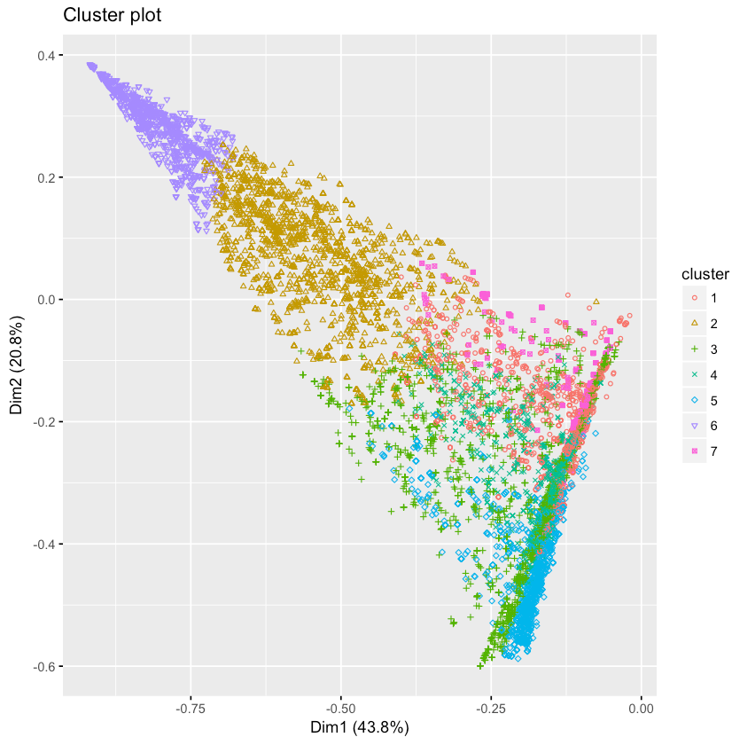
```

### Cluster Descriptions 
Now that we’ve determined how many clusters to use, it’s useful to inspect the clusters and assign qualitative labels based on the feature sets. The code snippet below shows how to compute the average feature values for the 7 different clusters.

&nbsp;
```{r eval=FALSE}
groups <- clarax$clustering
results <- as.data.frame(
           t(aggregate(affluent,list(groups),mean)))
results[2:18,]
```

The results of this code block are shown below. Based on these results, we came up with the following cluster descriptions:

- **V1:** Stocks/Bonds — 31% of assets, followed by home and mutual funds
- **V2:** Diversified — 53% busequity, 10% home and 9% in other real estate
- **V3:** Residential Real Estate — 48% of assets
- **V4:** Mutual Funds — 50% of assets
- **V5:** Retirement — 48% of assets
- **V6:** Business Equity — 85% of assets
- **V7:** Commercial Real Estate — 59% of assets

With the exception of cluster V7, containing only 3% of the population, most of the clusters are relatively even in size. The second smallest cluster represents 12% of the population while the largest cluster represents 20%. You can use table(groups) to show the unweighted cluster population sizes.

```{r 6-12, echo=FALSE, out.width="80%", fig.align="center",  fig.cap="Asset allocation amounts for the 7-identified clusters."}
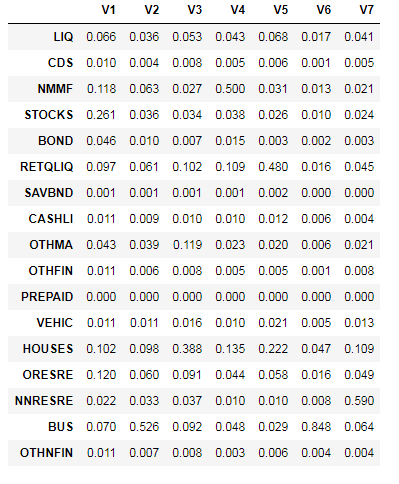
```

### Cluster Populations by Net Worth
The last step in this analysis is to apply the different cluster assignments to the overall population, and to group the populations by net worth segments. Since we trained the clusters on only affluent households, we need to use a classification algorithm to label the non-affluent households in the population. The code snippet below uses knn to accomplish this task. The remaining code blocks compute the number of households that are classified as each cluster, for each of the net worth segments.

&nbsp;
```{r eval=FALSE}
# assign all of the households to a cluster 
groups <- knn(train = affluent, test = households, 
 cl = clarax$clustering, k = k, prob = T, use.all = T)

# figure out how many households are in each cluster 
clusters <- data.frame(
  c1 = ifelse(groups == 1, weights, 0), 
  ... 
  c7 = ifelse(groups == 7, weights, 0) 
)

# assign each household to a net worth cluster 
nw <- floor(2*log10(nwHouseholds))/2
results <- as.data.frame(t(aggregate(clusters,
                                  list(nw),sum)))

# compute the number of households for each segment
results$V1 <- results$V1/sum(ifelse(nw==4,weights,0))
...
results$V11 <- results$V11/sum(ifelse(nw==9,weights,0))

# plot the results 
plot <- plot_ly(results, x = ~10^Group.1, y = ~100*c1, 
  type='scatter', mode = 'lines', name = "Stocks") %>%
  add_trace(y = ~100*c2, name = "Diversified") %>%
  ...
  add_trace(y = ~100*c7, name = "Commercial R.E.") %>%
  layout(yaxis = list(title = '% of Households'),
     xaxis=list(title = "Net Worth ($)", type = "log"), 
     title="Cluster Populations by Net Worth")
``` 

The results of this process are shown in the figure below. The chart shows some obvious and some novel results: home ownership and retirement funds make up the majority of assets for non-affluent households, there is a relatively even mix of clusters around $2M (excluding commercial real estate and business equity), and business equity dominates net worth for the ultra-wealthy households, followed by other investment assets.

```{r 6-13, echo=FALSE, out.width="100%", fig.cap="How the distribution of clusters varies based on Household Net Worth."}
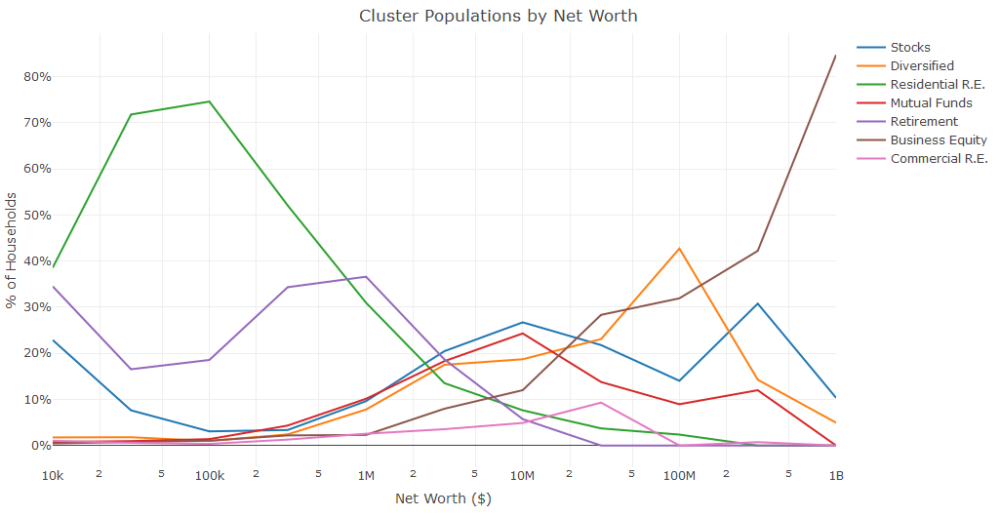
```

For this clustering example, I explored survey data and identified seven different types of affluent households. I then used these clusters to assign labels to the remaining households. A similar approach could be used at a startup to assign segmentation labels to the user base.

## Conclusion
Predictive modeling is an application of machine learning with a wide variety of tools that can be used to get started. One of the first things to consider when building a predictive model is determining the outcome that you’re trying to predict, and establishing metrics that you’ll use to measure success.

In this chapter, I showed four different approaches for building classification models for predicting twins during pregnancy. I showed how the GUI based tools Weka and BigML can be used to evaluate logistic regression models, ensemble models, and deep nets. I also scripting examples for performing logistic regression with regularization in R, and random forests in Python. I concluded the chapter with an example of clustering, which may by useful for performing segmentation tasks for a startup.

Independent of the approach being used to build a predictive model, it’s important to be able to output a model specification as a result of your training process. This can be a list of coefficient weights for a linear regression model, a list of nodes and weights for a random forest model, or a list of neuron weights and activations for a deep learning network. In the next chapter, I’ll discuss how to scale predictive models to millions of users, and being able to represent a trained model as a specification is a prerequisite to production.
