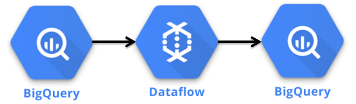
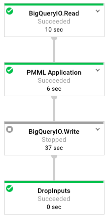
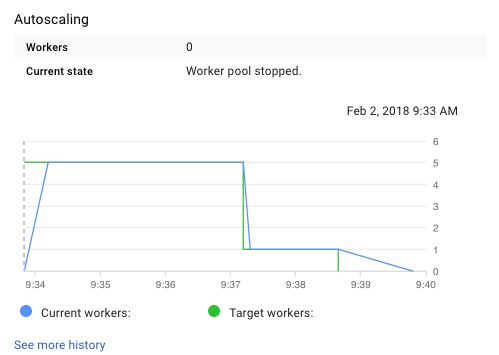
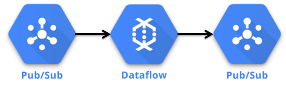

# Productizing Models
One the key ways that a data scientist can provide value to a startup is by building data products that can be used to improve products. Making the shift from model training to model deployment means learning a whole new set of tools for building production systems. Instead of just outputting a report or a specification of a model, productizing a model means that a data science team needs to support operational issues for maintaining a live system.

An approach I’ve used to ease this transition is managed tools, such as Google Dataflow, which provides a managed and scalable solution for putting models into production. Most of the approaches discussed in this chapter are using a serverless approach, because it’s usually a better fit for startups than manually provisioning servers. Using tools like Dataflow also enables data scientists to work much closer with engineering teams, since it’s possible to set up staging environments were portions of a data pipeline can be testing prior to deployment. Most early data scientists at a startup will likely be playing an ML engineer role as well, by building data products.

Rather than relying on a engineering team to translate a model specification to a production system, data scientists should have the tools needed to scale models. One of the ways I’ve accomplished this in the past is by using predictive model markup language (PMML) and Google’s Cloud Dataflow. Here is the workflow I recommend for building and deploying models:

- Train offline models in R or Python
- Translate the models to PMML
- Use Dataflow jobs to ingest PMML models for production

This approach enables data scientists to work locally with sampled data sets for training models, and then use the resulting model specifications on the complete data set. The third step may take some initial support from an engineering team, but only needs to be set up once. Using this approach means that data scientists can use any predictive model supported by PMML, and leveraging the managed Dataflow service means that the team does not need to worry about maintaining infrastructure.

In this chapter, I’ll discuss a few different ways of productizing models. First, I discuss how to train a model in R and output the specification to PMML. Next, I provide examples of two types of model deployments: batch and live. And finally, I’ll discuss some custom approaches that I’ve seen teams use to productize models.

## Building a Model Specification
To build a predictive model, we’ll again use the Natality public data set. For this chapter, we’ll build a linear regression model for predicting birth weights. The complete notebook for performing the model building and exporting process is available online^[https://github.com/bgweber/WindfallData/blob/master/natality]. The first part of the script downloads data from BigQuery and stores the results in a data frame.

&nbsp;
```{r eval=FALSE}
library(bigrquery)
project <- "gcp_project_id"

sql <- "
 SELECT year, plurality, apgar_5min, mother_age
       ,father_age,  gestation_weeks, ever_born
       ,mother_married, weight_pounds
 FROM `bigquery-public-data.samples.natality`
 order by rand() 
 LIMIT 10000"

df <- query_exec(sql, project = project
                 , use_legacy_sql = FALSE)
```

Next, we train a linear regression model to predict the birth weight, and compute error metrics:

&nbsp;
```{r eval=FALSE}
lm <- lm(weight_pounds ~ ., data = df)
summary(lm)
cor(df$weight_pounds, predict(lm, df))
mean(abs(df$weight_pounds - predict(lm, df))) 
sqrt(mean(abs(df$weight_pounds - predict(lm, df)^2)))
```

Which produces the following results:

- Correlation Coefficient: 0.335
- Mean Error: 0.928
- RMSE: 6.825

The model performance is quite weak, and other algorithms and features could be explored to improve it. Since the goal of this chapter is to focus on productizing a model, the trained model is sufficient.

The next step is to translate the trained model into PMML. The r2pmml R package and the jpmml-r tool make this process easy and support a wide range of different algorithms. The first library does a direct translation of a R model object to a PMML file, while the second library requires saving the model object to an RDS file and then running a command line tool. We used the first library to do the translation directly:

&nbsp;
```{r eval=FALSE}
library(r2pmml)
r2pmml(lm, "natality.pmml")
```

This code generates the following pmml file. The PMML file format specifies the data fields to use for the model, the type of calculation to perform (regression), and the structure of the model. In this case, the structure of the model is a set of coefficients, which is defined as follows:

&nbsp;
```{r eval=FALSE}
<RegressionTable intercept="7.5619">   
  <NumericPredictor name="year" 
                           coefficient="3.6683E-4"/>
  <NumericPreda ictor name="plurality" 
                           coefficient="-2.0459"/> 
  ...
  <NumericPredictor name="mother_married" 
                          coefficient="0.2784"/>  
</RegressionTable>
```

We now have a model specification that we are ready to productize and apply to our entire data set.

## Batch Deployments
In a batch deployment, a model is applied to a large collection of records, and the results are saved for later use. This is different from live approaches which apply models to individual records in near real-time. A batch approach can be set up to run of a regular schedule, such as daily, or ad-hoc as needed.

### SQL Query 
The first approach I’ll use to perform batch model deployment is one of the easiest approaches to take, because it uses BigQuery directly and does not require spinning up additional servers. This approach applies a model by encoding the model logic directly in a query. For example, we can apply the linear regression model specified in the PMML file as follows:

&nbsp;
```{r eval=FALSE}
select weight_pounds as actual,  
  + 11.82825946749738
  + year * -0.0015478882184680862
  + plurality * -2.1703912756511254
  + apgar_5min * -7.204416271249425E-4
  + mother_age * 0.011490472355621577
  + father_age * -0.0024906543152388157
  + gestation_weeks * 0.010845982465606988
  + ever_born * 0.010980856659668442
  + case when mother_married then 1 else 0 end*0.264942
    as predicted
from records
```

The result is that each record in the data set now has a predicted value, calculated based on the model specification. For this example, I manually translated the PMML file to a SQL query, but you could build a tool to perform this function. Since all of the data is already in BigQuery, this operation runs relatively quickly and is inexpensive to perform. It’s also possible to validate a model against records with existing labels in SQL:

&nbsp;
```{r eval=FALSE}
select sum(1) as records
  ,corr(actual, predicted) as Correlation
  ,avg(abs(actual - predicted)) as MAE
  ,avg(abs( (predicted - actual)/actual )) as Relative
from predictions
```

The results of this query show that our model has a mean-absolute error of 0.92 lbs, a correlation coefficient of 0.33, and a relative error of 15.8%. Using SQL is not limited to linear regression models, and can be applied to a wide range of different types of models, even Deep Nets. Here’s how to modify the prior query to compute a logistic rather than linear regression:

&nbsp;
```{r eval=FALSE}
1/(1 + exp(-1*(
    --regression calculation
))) as predicted
```

I’ve also used this approach in the past to deploy boosted models, such as AdaBoost. It’s useful when the structure of the model is relatively simple, and you need the results of the model in a database.

### DataFlow — BigQuery

```{r 7-1, echo=FALSE, out.width="100%", fig.align="center", fig.cap="Components in the BigQuery Batch Deployment."}

```

If your model is more complex, Dataflow provides a great solution for deploying models. When using the Dataflow Java SDK, you define an graph of operations to perform on a collection of objects, and the service will automatically provision hardware to scale up as necessary. In this case, our graph is a set of three operations: read the data from BigQuery, calculate the model prediction for every record, and write the results back to BigQuery. This pipeline generates the following Dataflow DAG:

```{r 7-2, echo=FALSE, out.width="50%", fig.align="center", fig.cap="The Dataflow graph of operations used in this tutorial."}

```

I use IntelliJ IDEA for authoring and deploying Dataflow jobs. While setting up the Java environment is outside of the scope of this book, the pom file used for building the project is available on Github. It includes the following dependencies for the Dataflow sdk and the JPMML library:

&nbsp;
```{r eval=FALSE}
<dependency>            
  <groupId>com.google.cloud.dataflow</groupId>              
  <artifactId>google-cloud-dataflow-java-sdk-all
      </artifactId>   
  <version>2.2.0</version>        
</dependency>
<dependency>            
  <groupId>org.jpmml</groupId>            
  <artifactId>pmml-evaluator</artifactId>            
  <version>1.3.9</version>  
</dependency>
```

As shown in the figure below, our data flow job consists of three steps that we’ll cover in more detail. Before discussing these steps, we need to create the pipeline object:

&nbsp;
```{r eval=FALSE}
PmmlPipeline.Options options = PipelineOptionsFactory
  .fromArgs(args).withValidation()
  .as(PmmlPipeline.Options.class); 
Pipeline pipeline = Pipeline.create(options);
```

We create a pipeline object, which defines the set of operations to apply to a collection of objects. In our case, the pipeline is operating on a collection of TableRow objects. We pass an options class as input to the pipeline class, which defines a set of runtime arguments for the dataflow job, such as the GCP temporary location to use for running the job.

The first step in the pipeline is reading data from the public BigQuery data set. The object returned from this step is a PCollection of TableRow objects. The feature query String defines the query to run, and we specify that we want to use standard SQL when running the query.

&nbsp;
```{r eval=FALSE}
private static final String query =     
  "SELECT year, plurality, ... weight_pounds\n" +
  "FROM `bigquery-public-data.samples.natality`";

pipeline.apply(BigQueryIO.read().fromQuery(query)           
   .usingStandardSql().withoutResultFlattening())
```

The next step in the pipeline is to apply the model prediction to every record in the data set. We define a PTransform that loads the model specification and then applies a DoFn that performs the model calculation on each TableRow.

&nbsp;
```{r eval=FALSE}
.apply("PMML Application", new PTransform
    <PCollection<TableRow>, PCollection<TableRow>>() {
    
model=new RegressionModelEvaluator(PMMLUtil.unmarshal(
 Resources.getResource("natality.pmml").openStream()));

return input.apply("To Predictions", ParDo.of(
    new DoFn<TableRow, TableRow>() {           
     @ProcessElement          
      
     public void processElement(ProcessContext c) {
     /* Apply Model */
}})))
```

The apply model code segment is shown below. It retrieves the TableRow to create an estimate for, creates a map of input fields for the pmml object, uses the model to estimate the birth weight, creates a new TableRow that stores the actual and predicted weights for the birth, and then adds this object to the output of this DoFn. To summarize, this apply step loads the model, defines a function to transform each of the records in the input collection, and creates an output collection of prediction objects.

&nbsp;
```{r eval=FALSE}
TableRow row = c.element();
HashMap<FieldName, Double> inputs = new HashMap<>();            
for (String key : row.keySet()) {              
  if (!key.equals("weight_pounds")) {                   
    inputs.put(FieldName.create(key), Double
        .parseDouble(row.get(key).toString()));              
  }
}

Double estimate =(Double)model.evaluate(inputs)
  .get(FieldName.create("weight_pounds"));
  
TableRow prediction = new TableRow();            
prediction.set("actual_weight", Double.parseDouble(
    row.get("weight_pounds").toString()));            
    prediction.set("predicted_weight", estimate);
c.output(prediction);
```

The final step is to write the results back to BigQuery. Earlier in the class, we defined the schema to use when writing records back to BigQuery.

&nbsp;
```{r eval=FALSE}
List<TableFieldSchema> fields = new ArrayList<>();    
fields.add(new TableFieldSchema()
   .setName("actual_weight").setType("FLOAT64"));    
fields.add(new TableFieldSchema()
   .setName("predicted_weight").setType("FLOAT64"));    

TableSchema schema=new TableSchema().setFields(fields);

.apply(BigQueryIO.writeTableRows()
  .to(String.format("%s:%s.%s",  proj, dataset, table))   
  .withCreateDisposition(Write.CreateDisposition     
  .CREATE_IF_NEEDED).withSchema(schema));

pipeline.run();
```

We now have a pipeline defined that we can run to create predictions for the entire data set. The full code listing for this class is available online^[https://github.com/bgweber/StartupDataScience/tree/master/Productizing]. Running this class spins up a Dataflow job that generates the DAG shown above, and will provision a number of GCE instances to complete the job. Here’s an example of the autoscaling used to run this pipeline:

```{r 7-3, echo=FALSE, out.width="80%", fig.align="center", fig.cap="Autoscaling the Model Predicting Task."}

```

When the job completes, the output is a new table in our BigQuery project that stores the predicted and actual weights for all of the records in the natality data set. If we want to run a new model, we simply need to point to a new PMML file in the data flow job. All of the files needed to run the offline analysis and data flow project are available on Github.

### DataFlow — DataStore

```{r 7-4, echo=FALSE, out.width="100%", fig.align="center", fig.cap="Components in the Datastore Batch Deployment."}
knitr::include_graphics("images/7-4.png")
```

Usually the goal of deploying a model is making the results available to an endpoint, so that they can be used by an application. The past two approaches write the results to BigQuery, which isn’t the best place to store data that needs to be used transactionally. Instead of writing the results to BigQuery, the data pipeline discussed in this section writes the results to Datastore, which can be used directly by a web service or application.

The pipeline for performing this task reuses the first two parts of the previous pipeline, which reads records from BigQuery and creates TableRow objects with model predictions. I’ve added two steps to the pipeline, which translate the TableRow objects to Datastore entities and write the results to Datastore:

&nbsp;
```{r eval=FALSE}
.apply("To DS", ParDo.of(new DoFn<TableRow, Entity>() {
  
  @ProcessElement
  public void processElement(ProcessContext c) {
    TableRow row = c.element();
    
    // Create a lookup key for the record
    String keyName = row.get("recordID").toString();
    Key.Builder keyBuilder = Key.newBuilder();
    Key.PathElement.Builder path = Key.PathElement.
     newBuilder().setKind("Profile").setName(keyName);
    keyBuilder.addPath(path);
    Key key = keyBuilder.build();
    
     
    // set the experiment group
    String expGroup = Double.parseDouble(
         row.get("predicted_weight")
        .toString()) >= 8 ? "Control" : "Treatment";
    Value value = Value.newBuilder().
        setStringValue(expGroup).build();
    
    // create an entity to save to Datastore
    Entity.Builder builder = Entity
        .newBuilder().setKey(key);
    builder.putProperties("Experiment", value);
    c.output(builder.build());
  }
}))
.apply(DatastoreIO.v1().write().withProjectId(proj));
```

Datastore is a NoSQL database that can be used directly by applications. To create entities for entry into Datastore, you need to create a key. In this example, I used a recordID which is a unique identifier generate for the birth record using the row_number() function in BigQuery. The key is used to store data about a profile, that can be retrieved using this key as a lookup. The second step in this operation is assigning the record to an control or treatment group, based on the predicted birth weight. This type of approach could be useful for a mobile game, where users with a high likelihood of making a purchase can be placed into an experiment group that provides a nudge to make a purchase. The last part of this snippet builds the entity object and then passes the results to Datastore.

The resulting entities stored in Datastore can be used in client applications or web services. The Java code snippet below shows how to retrieve a value from Datastore. For example, a web service could be used to check for offers to provide to a user at login, based on the output of a predictive model.

&nbsp;
```{r eval=FALSE}
public static void main(String[] args) {
  Datastore datastore = DatastoreOptions
      .getDefaultInstance().getService();
  KeyFactory keyFactory = datastore
      .newKeyFactory().setKind("Profile");
  
  // get a user profile
  Entity profile = datastore.get(
      keyFactory.newKey("User101"));
  System.out.println(profile.getString("Experiment"));
}
```

## Live Deployments
The approaches we’ve covered so far have significant latency, and are not useful for creating real-time predictions, such as recommending new content for a user based on their current session activity. To build predictions in near real-time, we’ll need to use different types of model deployments.

### Web Service 
One of the ways that you can provide real-time predictions for a model is by setting up a web service that calculates the output. Since we already discussed Jetty in the chapter on tracking data, we’ll reuse it here to accomplish this task. In order for this approach to work, you need to specific all of the model inputs as part of the web request. Alternatively, you could retrieve values from a system like Datastore. An example of using Jetty and JPMML to implement a real-time model service is shown below:

&nbsp;
```{r eval=FALSE}
public void handle(...) throws IOException{
  
  // load the PMML model
  final ModelEvaluator<RegressionModel> evaluator;
  try {
    evaluator = new RegressionModelEvaluator(
        PMMLUtil.unmarshal(Resources.getResource(
        "natality.pmml").openStream()));
  }
  catch (Exception e) {
    throw new RuntimeException(e);
  }
  
  // create a map of inputs for the pmml model
  HashMap<FieldName, Double> inputs = new HashMap<>();
  for (String attribute : modelFeatures) {
    String value = baseRequest.getParameter(attribute);
    inputs.put(FieldName.create(attribute), 
        Double.parseDouble(value));
  }
  
  // output the estimate
  Double estimate =(Double)evaluator.evaluate(inputs)
      .get(FieldName.create("weight_pounds"));
  response.setStatus(HttpServletResponse.SC_OK);
  response.getWriter().println(
      "Prediction: " + estimate);
  baseRequest.setHandled(true);
}
```

The code processes a message request, which contains parameters with the values to use a model inputs. The snippet first loads the PMML specification, creates an input map of features using the web request parameters, applies the evaluator to get a predicted value, and writes the result as output. The modelFeatures array contains the list of features specified in the PMML file. A request to the service can be made as follows:

&nbsp; 
```{r eval=FALSE}
http://localhost:8080/&year=2000&plurality=1
  &apgar_5min=0&mother_age=30&father_age=28
  &gestation_weeks=40&ever_born=1&married=1
```

The result of entering this URL in your browser is a web page which lists the predicted weight of 7.547 lbs. In practice, you’d probably want to use a message encoding, such as JSON, rather than passing raw parameters. This approach is simple and has relatively low latency, but does require managing services. Scaling up is easy, because each model application can be performed in isolation, and no state is updated after providing a prediction.

### DataFlow - PubSub

```{r 7-5, echo=FALSE, out.width="100%", fig.align="center", fig.cap="Components in the PubSub Live Model Deployment."}

```

It’s also possible to use Dataflow in a streaming mode to provide live predictions. We used streaming Dataflow in the chapter on data pipelines in order to stream events to BigQuery and a downstream PubSub topic. We can use a similar approach for model predictions, using PubSub as a source and a destination for a DataFlow job. The Java code below shows how to set up a data pipeline that consumes messages from a PubSub topic, applies a model prediction, and passing the result as a message to an output PubSub topic. The code snippet excludes the process of loading the PMML file, which we already covered earlier in this chapter.

&nbsp;
```{r eval=FALSE}
// Read messages from PubSub
PCollection<PubsubMessage> events = pipeline.apply(
    PubsubIO.readMessages().fromTopic(inboundTopic));

// create a DoFn for applying the PMML model
events.apply("To Predictions", ParDo.of(
    new DoFn<PubsubMessage, PubsubMessage>() {
      
@ProcessElement
public void processElement(ProcessContext c) {
  PubsubMessage row = c.element();
  // create a map of inputs for the pmml model
  HashMap<FieldName, Double> inputs = new HashMap<>();
  for (String key : row.getAttributeMap().keySet()) {
    if (!key.equals("weight_pounds")) {
      inputs.put(FieldName.create(key),
          Double.parseDouble(row.getAttribute(key)));
    }
  }
  
  // get the estimate
  Double estimate = (Double)evaluator.evaluate(inputs)
      .get(FieldName.create("weight_pounds"));
      
  // create a message with the prediction
  String message = "Prediction:" + estimate;
  PubsubMessage msg = new PubsubMessage(
      message.getBytes(), new HashMap());
  c.output(msg);
}}
.apply(PubsubIO.writeMessages().to(outboundTopic));
```

The code reads a message from an incoming topic and then parses the different attributes from the message to use as feature inputs for the model. The result is saved in a new message that is passed to an outbound topic. Since the Dataflow job is set to run in streaming mode, the pipeline will process the messages in near real-time as they are received. The full code listing for this pipeline is available on Github^[https://github.com/bgweber/StartupDataScience/tree/master/Productizing].

In practice, PubSub may have too much latency for this approach to be useful for directly handling web requests in an application. This type of approach is useful when a prediction needs to be passed to other components in a system. For example, it could be used to implement a user retention system, where mobile game users with a high churn likelihood are sent targeted emails.

### Custom Engineering
Other approaches that are viable for providing live model deployments are Spark streaming, AWS Lambda, and Kinesis analytics.

Sometimes it’s not possible for a data science team to build data products directly, because the system that needs to apply the model is owned by a different engineering team. For example, Electronic Arts used predictive models to improve matchmaking balance, and the team that built the model likely did not have direct access to the game servers executing the model. In a scenario like this, it’s necessary to have a model specification that can be passed between the two teams. While PMML is an option here, custom model specifications and encodings are common in industry.

I’ve also seen this process breakdown in the past, when a data science team needs to work with a remote engineering team. If a model needs to be translated, say from a Python notebook to Go code, it’s possible for mistakes to occur during translation, the process can be slow, and it may not be possible to make model changes once deployed.

## Conclusion
In order to provide value to a startup, data scientists should be capable of building data products that enable new features. This can be done in combination with an engineering team, or be a responsibility that lives solely with data science. My recommendation for startups is to use serverless technologies when building data products in order to reduce operational costs, and enable quicker product iteration.

This chapter presented different approaches for productizing models, ranging from encoding logic directly in a SQL query to building a web service to using different output components in a Dataflow task. The result of productizing a model is that predictions can now be used in products to build new features.

I also introduced the idea of segmenting users into different experiment groups based on a predicted outcome. In the next chapter, I’ll discussed different experimentation methodologies that can be used including A/B testing and staged rollouts.
