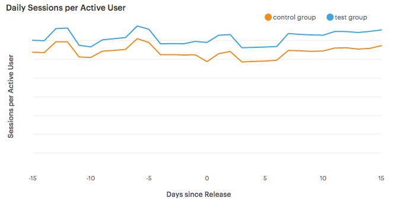
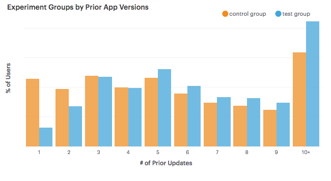
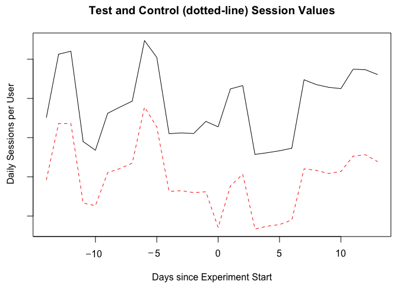
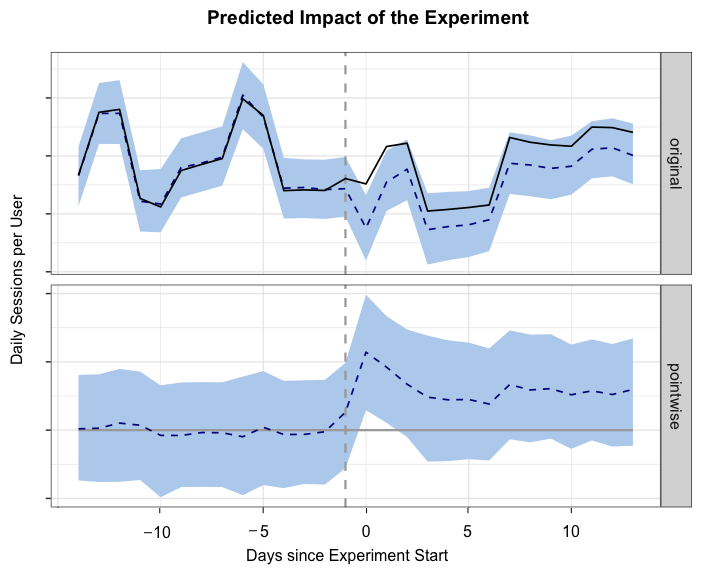
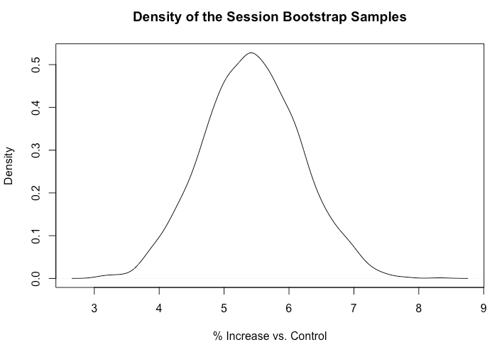

# Experimentation
It's important to be able to determine if changes made to a product are beneficial. Experimentation is one of the methods that can be used to perform this type of analysis. Ideally, you want to set up experiments across randomized groups that are identical expect for a single change being made. This is the process used for A/B testing, which can be used to draw strong statistical conclusions. However, it's not always possible to use this methodology, since it may not be possible to control which users are part of a treatment group for an experiment. 

This was the case when I was part of the mobile team at Twitch and we deployed a product update using the staged rollout feature of Google Play. This chapter provides an overview of this case study, and discusses two different approaches for drawing conclusions when you do not have direct control of assigning experiment groups. The second approach presented in this chapter, bootstrapping, can be applied directly when performing A/B testing. Additional details on A/B testing at Twitch are available online^[https://towardsdatascience.com/the-three-types-of-a-b-tests-ac544a5783f8]. 

## Staged Rollouts
Experimentation is one of the core functions of data science at startups, and you should be able to work closely with product managers to test out new ideas and features. In the past, I’ve used in-house tools to perform A/B experiments on the web and in mobile applications. However, I used a new approach for performing experiments when using Google Play’s staged rollout feature.

Staged rollouts enable developers to release a new build to a subset of the user base. Rather than implementing A/B logic within the application itself, by writing ‘if’ blocks that maintain separate treatment and control code paths, developers can build two separate versions and deploy them simultaneously. This feature is useful when making major changes to an application, such as redesigning the UI. A drawback of staged rollouts is that we no longer control the A/B splits for experiments. Common use cases for staged rollouts include:

1. Testing the stability of a new release
2. Measuring the usage of new features
3. Measure the impact of a new release on metrics

Since only a subset of users get the new app version, this feature is a great way to try out new ideas and rollback if any problems occur. It also enables developers to measure the adoption of new features in an Android application. Most companies do not use staged rollouts for the third usee case, which is running experiments.  .

We’d like to use staged rollouts to measure the impact of new releases on an existing set of metrics, such as daily active users. This feature is most useful when making major changes to an application, where embedding the A/B logic for multiple application versions within a single binary is complex.

Our initial approach was to use A/B testing with the staged rollout feature. In this approach, the Google Play store selects a subset of the users as eligible for the test app version. Users that are eligible and update to the new version, whether automatic or manual, are labeled as the test group. Users that do not update to the new version are labeled as the control group, which may include eligible users that did not install the update. Users that updated to the new version after a fixed period of time, 1 week for our experiment, were not included in the experiment because they overlapped.

Google Play uses a randomized approach to select the different experiment groups, and we can measure key metrics across these groups. However, we found biases in the data which prevented us from using our standard approaches for A/B testing.

```{r 8-1, echo=FALSE, out.width="100%", fig.align="center", fig.cap="Daily Sessions for the Different Groups."}

```

The chart above shows the mean daily sessions per active user for our test and control groups from a staged rollout. We found that users with the new app version were more active than other users prior to the experiment, meaning that a key assumption of A/B testing did not hold: randomized sampling should minimize bias by equalizing all other factors.

Since this assumption did not hold true, we needed to use new techniques in order to measure the performance of our experiments and communicate results to our Product Managers. We want to be able to answer the following questions:

1. Did the new release have a positive impact on our metrics?
2. Is the change significant?
3. How big is the change?

Typically, we compare the difference between the test and control groups for a time period following the release of the experiment version. To account for the biases in user groups with staged rollouts, we measured key metrics for the experiment groups before and after the new release, and compared the pre-experiment differences between these groups. We use two approaches for this analysis:

- Time-Series Analysis
- Difference-in-Differences Estimation

We use the first approach to estimate absolute changes in key metrics using aggregate-level data and the second approach to perform significance testing on a collection of metrics using user-level data. Both approaches are used to account for biases in the way that staged rollouts sample users.

### Staged Rollout Biases 
One of the issues to be aware of when using staged rollouts on Google Play is that it may take several days for users to update to the new binary release (APK). We used a 10% sample rate for our test build, and it took about 2 weeks for users to converge to this value. The chart above shows the adoption rate of the new APK, where adoption rate is defined as the number of users that updated over the total number of active users.

```{r 8-2, echo=FALSE, out.width="90%", fig.align="center", fig.cap="Adoption rate of APKs in the experiment."}
knitr::include_graphics("images/8-2.png")
```

We found that including new users results in a faster adoption rate, but excluded new users in our analysis. The time-series and difference-in-differences methods both rely on data being collected for each user prior to the launch of the experiment, and new users have no prior data. For the experiment detailed later in this chapter, we only included users that updated within 1 week which resulted in an adoption rate of 8.3%.

In order to try to explain the biases in the data, we explored a variety of variables that may be responsible. The following variables where not significant in determining which groups users were assigned to: country and device model.

The variables that did show biases in the groups were the starting month for the user, and the number of prior updates. A bias towards users that have upgraded more in the past was not surprising, because users need to update in order to be included in the test group.

```{r 8-3, echo=FALSE, out.width="100%", fig.align="center", fig.cap="Prior updates for the experiment groups."}

```

### Time Series Analysis
One of the metrics we measured for our staged rollout experiment was the average number of sessions per active user. To estimate the absolute change in this metric between the test and control group we used the CausalImpact R package, which performs Bayesian time-series modeling. This approach estimates the value of the test group’s time series if no intervention occurred, and uses this estimation to provide a prediction of the relative and absolute changes in metrics. A key assumption of this approach is that the control group is not impacted by any changes made.

```{r 8-4, echo=FALSE, out.width="100%", fig.align="center", fig.cap="Daily Sessions for the experiment groups."}

```

The chart above shows the time series for our test and control groups. The solid line is the average sessions metric for the test group, which was larger than the control group prior to the experiment. We used a two-week period before and after the release date for measuring key metrics.

&nbsp;
```{r eval=FALSE}
library(CausalImpact) 
data <- read.csv(file = "DailySessions.csv")

# Create a DataFrame and plot the input data 
ts <- cbind(data$test, data$control)
matplot(ts, type = "l")

# Use two week prior and post periods and plot results  
pre.period <- c(1, 14)
post.period <- c(15, 30) 
impact <- CausalImpact(ts, pre.period, post.period)

# Plot the results and explain the outcome 
plot(impact, c("original", "pointwise")) 
summary(impact, "report")
```

We used the CausalImpact R package to estimate the impact of the new app version on our session metric. The code snippet above shows how to use this package to build an estimate for the test group. For this experiment, the relative increase was +4% daily sessions per active user, with a 95% confidence interval of [+2%, +5%].

```{r 8-5, echo=FALSE, out.width="100%", fig.align="center", fig.cap="Generating visualizations with CausalImpact."}

```

This approach is useful when only aggregate data is available. To test multiple variables independent of a time component, we use bootstrapping.

### Difference-in-Differences Estimation
We usually track a collection of metrics when performing experiments at Twitch. Bootstrapping is a robust resampling process that enables our teams to measure changes in metrics with confidence intervals. For our staged rollout experiment, we used bootstrapping to measure the difference-in-differences between our test and control groups.

&nbsp;
```{r eval=FALSE}
library(boot)
data <- read.csv("UserSessions.csv")

# Function for computing the difference of differences 
run_DiD <- function(data, indices){
  d <- data[indices,]
  new <- mean(d$postval[d$group=='Test'])/
             mean(d$priorval[d$group=='Test'])
  old <-mean(d$postval[d$expgroup=='Control'])/
             mean(d$priorval[d$expgroup=='Control'])
  return((new - old)/old * 100.0) 
}

# perform the bootstrapping and output the results 
boot_est <- boot(data, run_DiD, R=1000, 
                   parallel="multicore", ncpus = 8)  
quantile(boot_est$t, c(0.025, 0.975)) 
plot(density(boot_est$t),xlab="% Increase vs. Control")
```

For each user, we measured the total number of sessions for the 14 days prior to the test version release and the 14 days following the release date. We then performed thousands of samples, where we computed the mean values for the differences between prior and post values and computed the percent increase between the test and control means. We used the boot R package to perform these calculations, as shown above. The model estimated a +5.4% increase in total sessions per user, with a 95% confidence interval of [+3.9%, +6.9%].

```{r 8-6, echo=FALSE, out.width="100%", fig.align="center", fig.cap="Bootstrapping results for session counts."}

```

## Conclusion  
We found biases in the data when using Google’s staged rollout feature and applied new methods for running experiments with this feature. Both of the approaches used found that the new app release resulted in a significant increase in sessions per user. The time-series method is useful for cases where only aggregate-level data is available, and the bootstrapping approach is useful for testing multiple values independent of a time component. The rollout feature provides a mechanism for testing new builds, but doesn’t work with standard A/B testing approaches. For further reading, explore the following papers on Causal Impact^[https://ai.google/research/pubs/pub41854] and A/B Testing at Facebook^[https://www.kellogg.northwestern.edu/faculty/gordon_b/files/kellogg_fb_whitepaper.pdf].

The case study presented in this chapter shows the importance of moving beyond standardized tools for performing experiments. While using vendor solutions is a great way to get started with running experiments, it's useful to be able to manually perform the experimentation analysis if a situation arises that the tool does not cover. It's important to question your assumptions when running experiments and to not draw too strong of conclusions from a single test.
