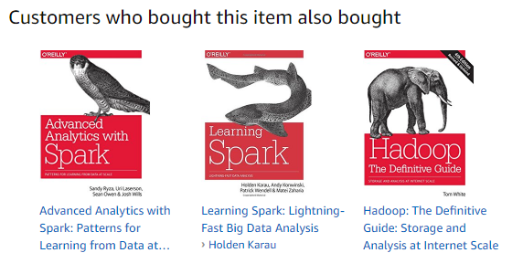

# Recommendation Systems
At a startup a data scientist is usually responsible for prototyping a new data products, such as a recommendation system. At Twitch, many of the products are powered by recommendation systems including VOD recommendations, Clips recommendations, and similar channels. Before productizing a recommendation system at Twitch, the science team first prototypes a recommendation system to see if the output is useful for one of our products. Prototyping a recommendation can be low cost, and this chapter provides examples of building a recommendation system in four different programming languages.

```{r 9-1, echo=FALSE, out.width="100%", fig.align="center", fig.cap="Amazon.com recommendations for “Mahout in Action”."}

```

Each of the examples uses a different library to prototype a recommendation system using collaborative filtering. An introduction to the collaborative filtering approach used on Amazon.com is available in this paper^[https://www.cs.umd.edu/~samir/498/Amazon-Recommendations.pdf], and a good overview of the different algorithms and similarity measures used in recommendations systems is covered in Mahout in Action [@Mahout]. I also provide an overview of recommendation systems in my GDC Talk^[http://www.gdcvault.com/play/1021850] on the marketplace in EverQuest Landmark. User-based collaborative filtering is used in all of the examples below, except for the Scala example which uses alternating least squares (ALS).

The examples load a data set and then recommend five items for the user with ID 101. The synthetic data set used in these examples is a collection of user purchases of games, where each line includes a user ID and a game ID. The example data set and source code for all examples is available on GitHub^[https://github.com/bgweber/Twitch/tree/master/Recommendations].

## R - Recommender Lab 
If R is your programming language of choice, the recommenderlab package makes it easy to prototype different recommendation systems. The package is available on the CRAN repository and can be installed using the standard install.packages function. Once loaded, the package provides a Recommender function which takes a data matrix and recommendation method as inputs. In this script, the data matrix is loaded from a CSV file, and the method used is user-based collaborative filtering. The predict function is then used to retrieve five items for user 101.

&nbsp;
```{r eval=FALSE}
install.packages("recommenderlab")
library(recommenderlab)
matrix <- as(read.csv("Games.csv"),"realRatingMatrix")

model <-Recommender(matrix, method = "UBCF")
games <- predict(model, matrix["101",], n=5)
as(games, "list")
```

## Java - Apache Mahout
Mahout is a machine learning library implemented in Java that provides a variety of collaborative filtering algorithms. Mahout implements user-based collaborative filtering with a UserNeighborhood class that specifies how similar a user needs to be in order to provide feedback for item recommendations. This example uses the Tanimoto similarity measure to find the similarity between users, which computes the ratio of the number of shared games (intersection) over the total number of games owned by the players (union). This CSV file is used as input to a data model which is then passed to the recommender object. Once a recommender object has been instantiated, the recommend method can be used to create a list of game recommendations for a specific user.

&nbsp;
```{r eval=FALSE}
import org.apache.mahout.cf.taste.*;
DataModel model = new 
          FileDataModel(new File("Games.csv"));
UserSimilarity similarity = new
  TanimotoCoefficientSimilarity(model);
UserNeighborhood neighborhood = 
  new ThresholdUserNeighborhood(0.1,similarity,model);
UserBasedRecommender recommender = 
       new GenericUserBasedRecommender(
       model, neighborhood, similarity);
  
List recommendations = recommender.recommend(101, 5);
System.out.println(recommendations);
```

## Scala - MLlib 
One of the tools becoming more popular for building recommendation systems is Apache Spark, which provides a built-in library called MLlib that includes a collection of machine learning algorithms. This example first runs a query to retrieve game purchases in a UserID, GameID tuple format, and then transforms the data frame into a collection of ratings that can be used by the ALS model. Implicit data feedback is being used in this example, which is why the trainImplicit method is used instead of the train method. The input parameters to the train method are the game ratings, the number of latent features to use, the number of iterations to perform for matrix factorization, the lambda parameter which is used for regularization, and the alpha parameter which specifies how implicit ratings are measured. Once the model is trained, the recommendProducts method can be used to retrieve a recommended list of games for a user.

&nbsp;
```{r eval=FALSE}
import org.apache.spark.mllib.recommendation._
val games = sqlContext.read
    .format("com.databricks.spark.csv")
    .option("header", "false")  
    .option("inferSchema", "true")  
    .load("/Users/bgweber/spark/Games.csv")
    
val ratings = games.rdd.map(row =>
  Rating(row.getInt(0), row.getInt(1), 1)
)

val rank = 10
val model = ALS.trainImplicit(ratings,rank 5,0.01,1)
val recommendations = model.recommendProducts(101, 5)
recommendations.foreach(println)
```

## SQL - Spark SQL 
In situations where pulling data to a machine running Spark or R is too slow or expensive, you can use SQL to prototype a recommendation system. This approach may be computationally expensive to use, but can be useful for spot-checking a few results. The example below uses Spark SQL, because I wanted to make the example reproducible for the provided data set. The first part of the code loads the table from a CSV file and registers the loaded data frame as a temporary table. The second part of the example includes SQL CTAs that prepare the data and then scores games for a single user. The inner query computes the Tanimoto coefficient between users by finding the ratio in overlapping games divided by total number of games purchased, and the outer query returns an overall score for each retrieved game.

&nbsp;
```{r eval=FALSE}
val games = sqlContext.read
    .format("com.databricks.spark.csv")
    .option("header", "false")  
    .option("inferSchema", "true")  
    .load("/Users/bgweber/spark/Games.csv")
    
games.registerTempTable("games")
val result = sqlContext.sql("""
with users as (
    select _c0 as User_ID, sum(1) as NumGames 
    from games 
    group by 1 
)
, purchases as (
    select _c0 as User_ID, _c1 as Game_ID, NumGames
    from games g
    join users u
      on g._c0 = u.User_ID
)
select u.User_ID, v.Game_ID, sum(Tanimoto) GameWeight
from ( 
    select u.User_ID, v.User_ID as Other_User_ID,
        count(u.Game_ID)/(u.NumGames + v.NumGames - 
                        count(u.Game_ID)) as Tanimoto
    from purchases u
    Join purchases v
        on u.Game_ID = v.Game_ID 
    where u.User_ID = 101
    group by 1, 2, u.NumGames, v.NumGames
) u
Join purchases v
    on Other_User_ID = v.User_ID
group by u.User_ID, v.Game_ID
order by GameWeight desc
""")
result.show(5)
``` 

## Conclusion
These scripts have provided examples for how to retrieve game suggestions for a specific user. One of the ways to evaluate the quality of a recommender is to use a qualitative approach, in which the output of the recommender is manually examined for a small group of users. Another approach is to use the built-in evaluation metrics included in the different libraries. For example, recommenderlab and MLlib provide functions for computing ROC curves which can be used to evaluate different system configurations. When evaluating a recommender, it is also a good practice to compare the performance of the recommendation system to other handcrafted approaches, such as a top sellers list.

It's important to be familiar with a wide variety of tools as a data scientist at a startup, because you may need to prototype a data product outside of your preferred programming environment. This chapter was motivated based on a case study at Twitch and provides an overview of four different approaches that can be used to start prototyping a recommender system.
