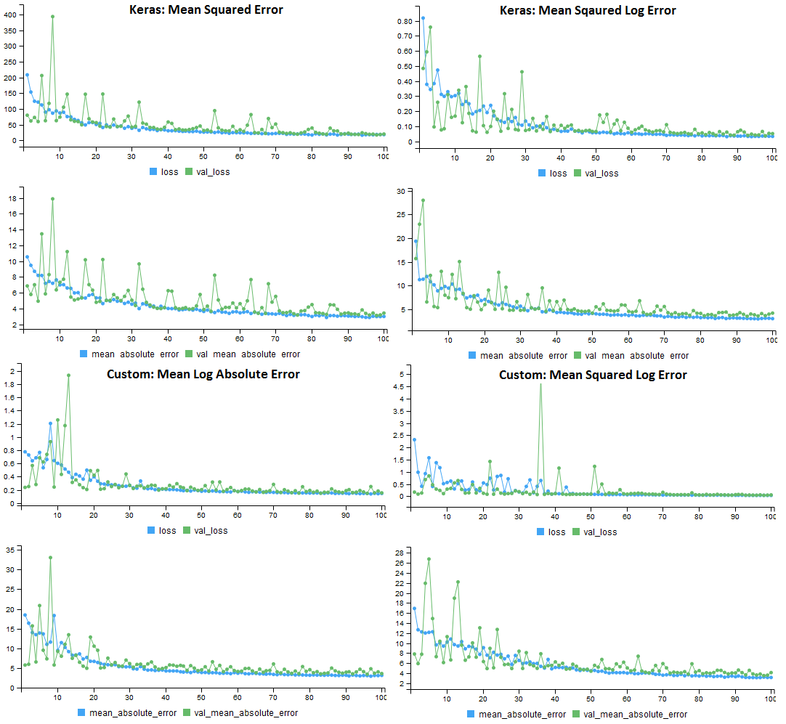
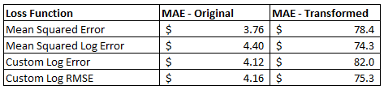
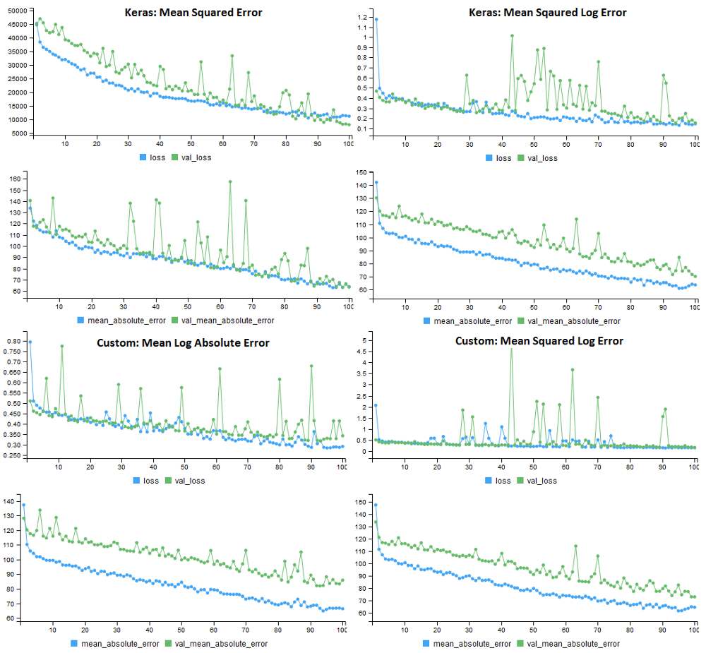

# Deep Learning
This chapter is a brief introduction to using the Keras deep learning framework to solve classic (shallow) machine learning problems. It presents a case study from my experience at Windfall Data, where I worked on a model to predict housing prices for hundreds of millions of properties in the US.

I recently started reading “Deep Learning with R” [@Deep], and I’ve been really impressed with the support that R has for digging into deep learning. One of the use cases presented in the book is predicting prices for homes in Boston, which is an interesting problem because homes can have such wide variations in values. This is a machine learning problem that is probably best suited for classical approaches, such as XGBoost, because the data set is structured rather than perceptual data. However, it’s also a data set where deep learning provides a really useful capability, which is the ease of writing new loss functions that may improve the performance of predictive models. The goal of this chapter is to show how deep learning can potentially be used to improve shallow learning problems by using custom loss functions.

One of the problems that I’ve encountered a few times when working with financial data is that often you need to build predictive models where the output can have a wide range of values, across different orders of magnitude. For example, this can happen when predicting housing prices, where some homes are valued at $100k and others are valued at $10M. If you throw standard machine learning approaches at these problems, such as linear regression or random forests, often the model will overfit the samples with the highest values in order to reduce metrics such as mean absolute error. However, what you may actually want is to treat the samples with similar weighting, and to use an error metric such as relative error that reduces the importance of fitting the samples with the largest values.

&nbsp;
```{r eval=FALSE}
# Standard approach to linear regression
fit <- lm(y ~ x1 + x2 + x3 + ... + x9, data=df)

# Linear regression with a log-log transformation 
fit <- nls(log10(y) ~ log(x1*b1 + x2*b2 + ... + x9*b9) 
   ,data = df, start = list(b1=1, b2=1, ... , b9 = 1))
```

You can actually do this explicitly in R, using packages such as nonlinear least squares (nls). The code sample above shows how to build a linear regression model using the built-in optimizer, which will overweight samples with large label values, and the nls approach which shows how to perform a log transformation on both the predicted values and labels, which will give the samples relatively equal weight. The problem with the second approach is that you have to explicitly state how to use the features in the model, creating a feature engineering problem. An additional problem with this approach is that it cannot be applied directly to other algorithms, such as random forests, without writing your own likelihood function and optimizer. This is a for a specific scenario where you want to have the error term outside of the log transform, not a scenario where you can simply apply a log transformation to the label and all input variables.

Deep learning provides an elegant solution to handling these types of problems, where instead of writing a custom likelihood function and optimizer, you can explore different built-in and custom loss functions that can be used with the different optimizers provided. This chapter will show how to write custom loss functions in R when using Keras, and show how using different approaches can be beneficial for different types of data sets.

The image of error functions is a preview of what I’ll cover in this chapter. It shows the training history of four different Keras models trained on the Boston housing prices data set. Each of the models use different loss functions, but are evaluated on the same performance metric, mean absolute error. For the original data set, the custom loss functions do not improve the performance of the model, but on a modified data set, the results are more promising.

```{r 10-1, echo=FALSE, out.width="100%", fig.align="center", fig.cap="Performance of the 4 loss functions on the original housing prices data set. All models used MAE for the performance metric."}

```

## Improving Shallow Problems 
One of the great features of deep learning is that it can be applied to both deep problems with perceptual data, such as audio and video, and shallow problems with structured data. For shallow learning (classical ML) problems, you can often see improvements over shallow approaches, such as XGBoost, by using a custom loss function that provides a useful singal.

However, not all shallow problems can benefit from deep learning. I’ve found custom loss functions to be useful when building regression models that need to create predictions for data with different orders of magnitude. For example, predicting housing prices in an area where the values can range significantly. To show how this works in practice, we’ll use the Boston housing data set provided by Keras^[https://keras.io/datasets/#boston-housing-price-regression-dataset].

This data set includes housing prices for a suburb in Boston during the 1970s. Each record has 13 attributes that describe properties of the home, and there are 404 records in the training data set and 102 records in the test data set. In R, the dataset can be loaded as follows: dataset_boston_housing(). The labels in the data set represent the prices of the homes, in thousands of dollars. The prices range from $5k to $50k, and the distribution of prices is shown in the histograming on the left. The original data set has values with similar orders of magnitude, so custom loss functions may not be useful for fitting this data. The histogram on the right shows a transformation of the labels which may benefit from using a custom loss.

```{r 10-2, echo=FALSE, out.width="100%", fig.align="center", fig.cap="The Boston data set with original prices and the transformed prices."}
knitr::include_graphics("images/10-2.png")
```

To transform the data, I converted the labels back into absolute prices, squared the result, and then divided by a large factor. This results in a data set where the difference between the highest and lowest prices is 100x instead of 10x. We now have a prediction problem that can benefit from the use of a custom loss function. The R code to generate these plots is shown below.

&nbsp;
```{r eval=FALSE}
x <- (train_targets*1000)^2/2500000
hist(train_targets, main = "Original Prices")
hist(x, main = "Transformed Prices")
```

## Loss Functions in Keras
Keras includes a number of useful loss function that be used to train deep learning models. Approaches such as mean_absolute_error() work well for data sets where values are somewhat equal orders of magnitude. There’s also functions such as mean_squared_logarithmic_error() which may be a better fit for the transformed housing data. Here are some of the loss functions provided by the R interface to Keras:

&nbsp;
```{r eval=FALSE}
keras::loss_mean_absolute_error()
keras::loss_mean_absolute_percentage_error()
keras::loss_mean_squared_error()
keras::loss_mean_squared_logarithmic_error()
```

The functions in losses.R refer to Python functions, and to really understand how these work we’ll need to jump into the Python losses code. The first loss function we’ll explore is the mean squared error, defined below. This function computes the difference between predicted and actual values, squares the result (which makes all of the values positive), and then calculates the mean value. Note that the function uses backend operations that operate on tensor objects rather than Python primitives. This same approach will be used when defining custom loss function in R

&nbsp;
```{r eval=FALSE}
def mean_squared_error(y_true, y_pred):    
    return K.mean(K.square(y_pred - y_true), axis=-1)
```

The next built-in loss function we’ll explore calculates the error based on the difference between the natural log of the predicted and target values. It is defined here^[https://github.com/keras-team/keras/blob/master/keras/losses.py#L28] and shown below. The function uses the clip operation to make sure that negative values are not passed to the log function, and adding 1 to the clip result makes sure that all log transformed inputs will have non-negative results. This function is similar to the one we will define in R.

&nbsp;
```{r eval=FALSE}
def mean_squared_logarithmic_error(y_true, y_pred):    
    first = K.log(K.clip(y_pred,K.epsilon(),None) + 1)
    second = K.log(K.clip(y_true,K.epsilon(),None) + 1)    
    return K.mean(K.square(first - second), axis=-1)
```         

The two custom loss functions we’ll explore are defined in the R code segment below. The first function, mean log absolute error (MLAE), computes the difference between the log transform of the predicted and actual values, and then averages the result. Unlike the built-in function above, this approach does not square the errors. One other difference from the log function above is that this function is applying an explicit scaling factor to the data, to transform the housing prices back to their original values (5,000 to 50,0000) rather than (5, 50). This is useful, because it reduces the impact of adding +1 to the predicted and actual values.

&nbsp;
```{r eval=FALSE}
# Mean Log Absolute Error
MLAE <- function( y_true, y_pred ) {
  K <- backend()
  K$mean( K$abs( K$log( K$relu(y_true *1000 ) + 1 ) - 
      K$log( K$relu(y_pred*1000 ) + 1)))
}
# Mean Squared Log Absolute Error
MSLAE <- function( y_true, y_pred ) {
  K <- backend()
  K$mean(K$pow(K$abs(K$log(K$relu(y_true*1000) + 1 ) - 
    K$log( K$relu(y_pred*1000 ) + 1)), 2))
}
```

Like the Python functions, the custom loss functions for R need to operate on tensor objects rather than R primitives. In order to perform these operations, you need to get a reference to the backend using backend(). In my system configuration, this returns a reference to tensorflow.

The second function computes the square of the log error, and is similar to the built in function. The main difference is that I’m using the relu operation rather than the clip operation, and I’m scaling the values, which is specific to the housing data set.

## Evaluating Loss Functions
We now have four different loss functions that we want to evaluate the performance of on the original and transformed housing data sets. This section will walk through setting up Keras, loading the data, compiling a model, fitting the model, and evaluating performance. The complete code listing for this section is available on github^[https://github.com/bgweber/StartupDataScience/blob/master/DeepLearning/LossFunctions.R].

First we need to set up our environment for deep learning. This can be done with the Keras package and the install_keras function.

&nbsp;
```{r eval=FALSE}
# Installation
devtools::install_github("rstudio/keras")
library(keras)
install_keras(method = "conda")
```

Once installed, we’ll load the data set and apply our transformation to skew housing prices. The last two operations can be commented out to use the original housing prices.

&nbsp;
```{r eval=FALSE}
# load the data set
library(keras)
data <- dataset_boston_housing()
c(c(train_data,train_targets), 
     c(test_data,test_targets)) %<-% data

# transform the training and test labels
train_targets <- (train_targets*1000)^2/2500000
test_targets <- (test_targets*1000)^2/2500000
```

Next, we’ll create a Keras model for predicting housing prices. I’ve used the network structure from the sample problem in “Deep Learning with R”. The network includes two layers of fully-connected relu activated neurons, and an output layer with no transformation.

&nbsp;
```{r eval=FALSE}
# The model as specified in "Deep Learning with R"
model <- keras_model_sequential() %>%
  layer_dense(units = 64, activation = "relu",
              input_shape = dim(train_data)[[2]]) %>%
  layer_dense(units = 64, activation = "relu") %>%
  layer_dense(units = 1)
```

To compile the model, we’ll need to specify an optimizer, loss function, and a metric. We’ll use the same metric and optimizer for all of the different loss functions. The code below defines a list of loss functions, and for the first iteration the model uses mean squared error.

&nbsp;
```{r eval=FALSE}
# Compile the model, and select a loss function
losses <- c(keras::loss_mean_squared_error,  
    loss_mean_squared_logarithmic_error, MLAE, MSLAE)
model %>% compile(
  optimizer = "rmsprop",
  loss = losses[1],
  metrics = c("mae")
)
```

The last step is to fit the model and then evaluate the performance. I used 100 epochs with a batch size of 5, and a 20% validation split. After training the model of the training data set, the performance of the model is evaluated on the mean absolute error on the test data set.

&nbsp;
```{r eval=FALSE}
# Train the model with validation
model %>% fit(
  train_data,
  train_targets,
  epochs = 100,
  batch_size = 5,
  verbose = 1,
  validation_split = 0.2
)

# Calculate the mean absolute error 
results <- model %>% evaluate(test_data, 
                     test_targets, verbose = 0)
results$mean_absolute_error
```

I trained four different models with the different loss functions, and applied this approach to both the original housing prices and the transformed housing prices. The results for all of these different combinations are shown below.

```{r 10-3, echo=FALSE, out.width="100%", fig.align="center", fig.cap="Performance of the Loss Functions on the Housing Price Data Sets."}

```

On the original data set, applying a log transformation in the loss function actually increased the error of the model. This isn’t really surprising given that the data is somewhat normally distributed and within a single order of magnitude. For the transformed data set, the squared log error approach outperformed the mean squared error loss function. This indicates that custom loss functions may be worth exploring if your data set doesn’t work well with the built-in loss functions.

The model training histories for the four different loss functions on the transformed data set are shown below. Each model used the same error metric (MAE), but a different loss function. One surprising result was that the validation error was much higher for all of the loss functions that applied a log transformation.

```{r 10-4, echo=FALSE, out.width="100%", fig.align="center", fig.cap="Performance of the 4 loss functions on the transformed housing prices data set. All models used MAE for the performance metric."}

```

## Conclusion
Deep learning can be a useful tool for shallow learning problems, because you can define custom loss functions that may substantially improve the performance of your model. This won’t work for all problems, but may be useful if you have a prediction problem that doesn’t map well to the standard loss functions.

For most data science problems faced by a startup, deep learning is likely overkill, unless you are working with perceptual data. It's useful to evaluate deep learning in addition to other methods, because it may perform better than classic approaches. However, scaling deep learning is usually more work than scaling classific approaches such as XGBoost, and there's also a loss of transparency in understanding how the model works.
